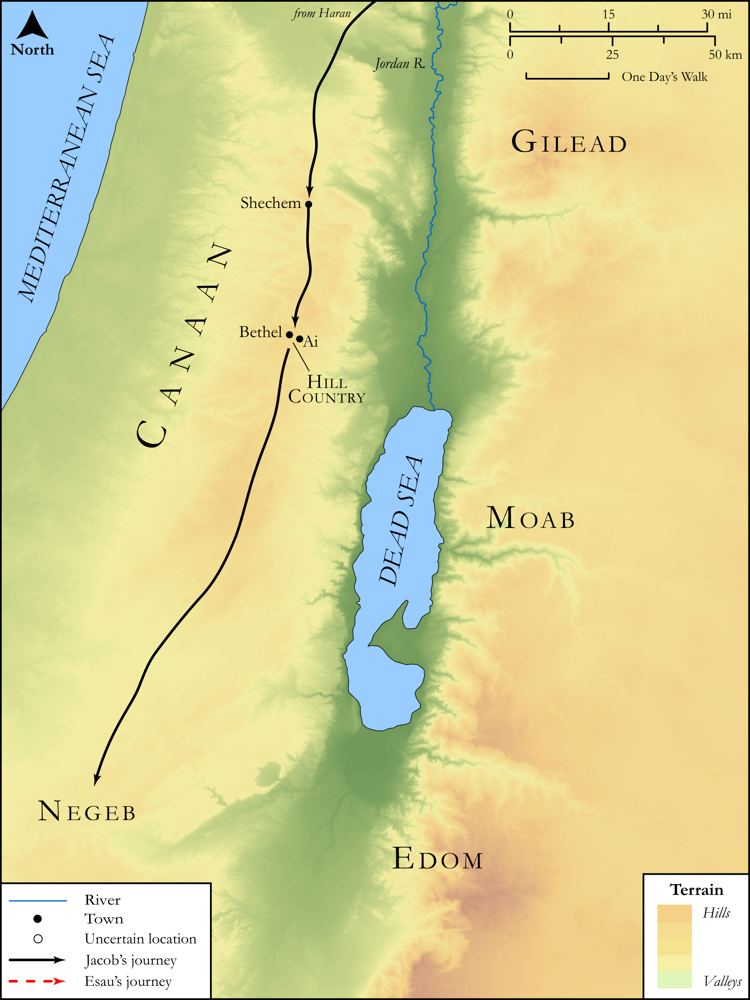

# Biblica Open Bible Maps

## License Information

Biblica Open Bible Maps, © 2023–2025 Biblica, Inc. This work is licensed under Creative Commons Attribution-ShareAlike 4.0 International (<a href="https://creativecommons.org/licenses/by-sa/4.0/">https://creativecommons.org/licenses/by-sa/4.0/</a>). More Information: <a href="https://docs.google.com/document/d/1Pp44yZ0Zdnd59vJHTrt2rPYq0SppfX5rZbPBt6mz37U/edit?tab=t.0#heading=h.oev9aj1ksvk2">https://docs.google.com/document/d/1Pp44yZ0Zdnd59vJHTrt2rPYq0SppfX5rZbPBt6mz37U/edit?tab=t.0#heading=h.oev9aj1ksvk2</a>

--------------------------------

## SRV Genesis: Gen. 12:1–9, Gen. 13:1–17 (id: OT260)

### Image Content

[link](images/OT260.png)

Original: [SRV Genesis: Gen. 12:1\-9, Gen. 13:1\-17](https://drive.google.com/open?id=12jSXfuUbisOt0EpOfRK2TbsKZJuqsnRv&usp=drive_copy)

* **Associated Passages:** Genesis 12:1-20

* **Associated ACAI Concepts:** Abraham (ID: `person:Abraham`); LORD (ID: `deity:Lord`); Pharaoh (ID: `person:Pharaoh.3`); Egypt (ID: `place:Egypt`); Sarah (ID: `person:Sarah`); Haran (ID: `place:Haran`); Bless (ID: `keyterm:Bless`); Canaan (ID: `place:Canaan`); Lot (ID: `person:Lot`); Egyptians (ID: `group:Egypt`); Stone Altar (ID: `realia:StoneAltar`); Temple Altar (ID: `realia:TempleAltar`); Altar (ID: `realia:Altar`); Tabernacle Altar (ID: `realia:TabernacleAltar`); Ai (ID: `place:Ai`); Oak of Moreh (ID: `place:Moreh`); Canaanites (ID: `group:Canaan`); Bethel (ID: `place:Bethel`); Shechem (ID: `place:Shechem`); Negev (ID: `place:Negeb`); To Curse (ID: `keyterm:Curse`); Oak (ID: `flora:Oak`); Donkey (ID: `fauna:Donkey`); Cattle (ID: `fauna:Bull`); Tent (ID: `realia:Tent`); Camel (ID: `fauna:Camel`); Flock (ID: `fauna:Flock`); Goat (ID: `fauna:Goat`)
