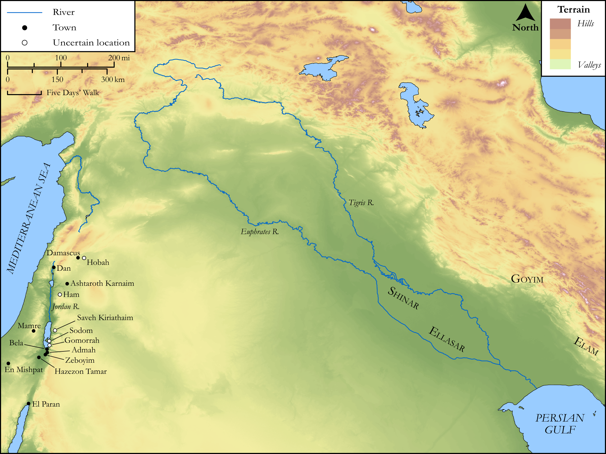

# Biblica Open Bible Maps

## License Information

Biblica Open Bible Maps, © 2023–2025 Biblica, Inc. This work is licensed under Creative Commons Attribution-ShareAlike 4.0 International (<a href="https://creativecommons.org/licenses/by-sa/4.0/">https://creativecommons.org/licenses/by-sa/4.0/</a>). More Information: <a href="https://docs.google.com/document/d/1Pp44yZ0Zdnd59vJHTrt2rPYq0SppfX5rZbPBt6mz37U/edit?tab=t.0#heading=h.oev9aj1ksvk2">https://docs.google.com/document/d/1Pp44yZ0Zdnd59vJHTrt2rPYq0SppfX5rZbPBt6mz37U/edit?tab=t.0#heading=h.oev9aj1ksvk2</a>

--------------------------------

## SRV Genesis: Gen. 14:1–15 (id: OT264)

### Image Content

[link](images/OT264.png)

Original: [SRV Genesis: Gen. 14:1\-15](https://drive.google.com/open?id=1B70h7edvssBEhnjWVxw61loL-9g_F2lF&usp=drive_copy)

* **Associated Passages:** Genesis 14:1-24

* **Associated ACAI Concepts:** Chedorlaomer (ID: `person:Chedorlaomer`); Sodom (ID: `place:Sodom`); Abraham (ID: `person:Abraham`); Gomorrah (ID: `place:Gomorrah`); LORD (ID: `deity:Lord`); Valley of Siddim (ID: `place:SiddimValley`); Eshcol (ID: `person:Eshcol`); Arioch (ID: `person:Arioch`); Goiim (ID: `group:Goiim`); Tidal (ID: `person:Tidal`); Aner (ID: `person:Aner`); Ellasar (ID: `place:Ellasar`); Amraphel (ID: `person:Amraphel`); Elam (ID: `place:Elam`); Mamre (ID: `place:Mamre`); Amorites (ID: `group:Amorites`); Lot (ID: `person:Lot`); Admah (ID: `place:Admah`); Zeboiim (ID: `place:Zeboiim`); Bless (ID: `keyterm:Bless`); Zoar (ID: `place:Zoar`); Shinar (ID: `place:Shinar`); El-paran (ID: `place:El-paran`); Jerusalem (ID: `place:Jerusalem`); Birsha (ID: `person:Birsha`); Hobah (ID: `place:Hobah`); Valley of Shaveh (ID: `place:Shaveh`); Damascus (ID: `place:Damascus`); Melchizedek (ID: `person:Melchizedek`); Hebrews (ID: `group:Hebrews`); Ashteroth-karnaim (ID: `place:Ashteroth-karnaim`); Dead Sea (ID: `place:SaltSea`); King’s Valley (ID: `place:KingsValley`); Bera (ID: `person:Bera`); Mamre (ID: `person:Mamre`); Shinab (ID: `person:Shinab`); Emim (ID: `group:Emim`); Zuzim (ID: `group:Zuzim`); Shemeber (ID: `person:Shemeber`); Seir (ID: `place:Seir`); Rephaim (ID: `group:Rephaim`); Kadesh-barnea (ID: `place:Kadesh-barnea`); Kiriathaim (ID: `place:Kiriathaim`); Horites (ID: `group:Hori`); Rebel (ID: `keyterm:Rebel`); Covenant (ID: `keyterm:Covenant`); Hori (ID: `person:Hori`); Amalekites (ID: `group:Amalek`); Force to Serve (ID: `keyterm:EnticedToServe`); En-gedi (ID: `place:Engedi`); Ammon (ID: `place:Ammon`); Amalek (ID: `place:Amalek`); Dan (ID: `place:Dan`); Wine (ID: `realia:Wine`); Thread (ID: `realia:Thread`); Oak (ID: `flora:Oak`); Vine (ID: `flora:Vine`)
