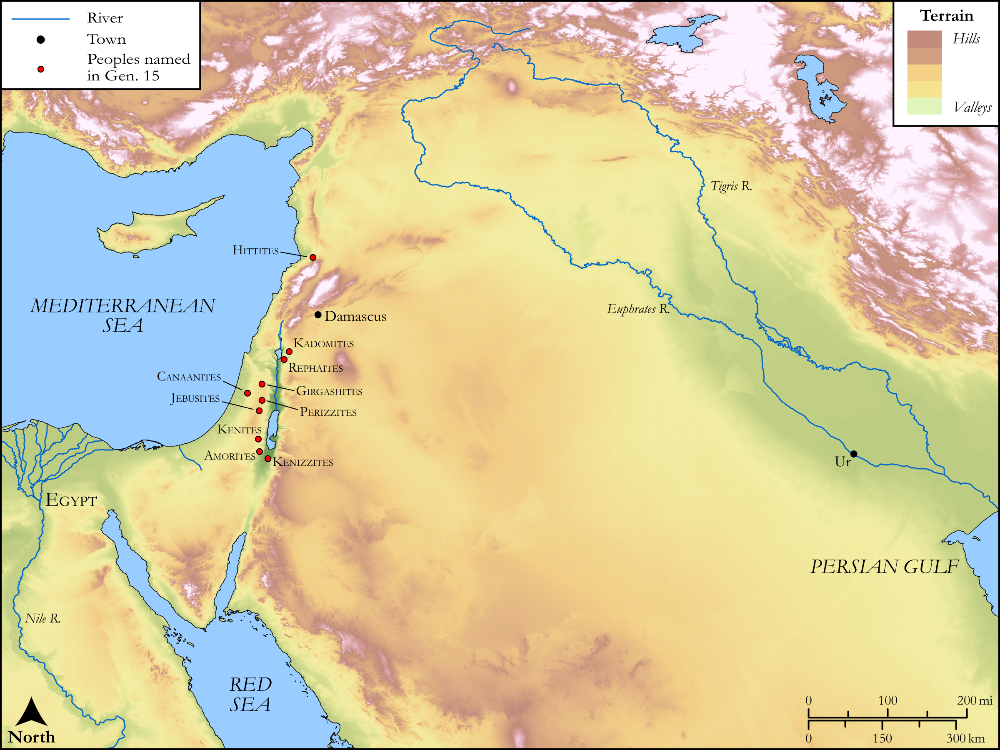

# Biblica Open Bible Maps

## License Information

Biblica Open Bible Maps, © 2023–2025 Biblica, Inc. This work is licensed under Creative Commons Attribution-ShareAlike 4.0 International (<a href="https://creativecommons.org/licenses/by-sa/4.0/">https://creativecommons.org/licenses/by-sa/4.0/</a>). More Information: <a href="https://docs.google.com/document/d/1Pp44yZ0Zdnd59vJHTrt2rPYq0SppfX5rZbPBt6mz37U/edit?tab=t.0#heading=h.oev9aj1ksvk2">https://docs.google.com/document/d/1Pp44yZ0Zdnd59vJHTrt2rPYq0SppfX5rZbPBt6mz37U/edit?tab=t.0#heading=h.oev9aj1ksvk2</a>

--------------------------------

## SRV Genesis: Gen. 15:1–21 (id: OT267)

### Image Content

[link](images/OT267.png)

Original: [SRV Genesis: Gen. 15:1\-21](https://drive.google.com/open?id=1C5hNmubIzy_smxWLYUPBkL1_4ZtJRPhb&usp=drive_copy)

* **Associated Passages:** Genesis 15:1-21

* **Associated ACAI Concepts:** LORD (ID: `deity:Lord`); Abraham (ID: `person:Abraham`); Dispossess (ID: `keyterm:Dispossess`); Amorites (ID: `group:Amorites`); Word of the Lord (ID: `keyterm:WordOfTheLord`); Force to Serve (ID: `keyterm:EnticedToServe`); Shield (ID: `keyterm:Shield`); Euphrates River (ID: `place:Euphrates`); Eliezer (ID: `person:Eliezer.2`); Kadmonites (ID: `group:Kadmonites`); Fear (ID: `keyterm:Fear`); Kenizzites (ID: `group:Kenizzites`); Chaldeans (ID: `group:Chaldea`); Believe In (ID: `keyterm:BelieveIn`); Egypt (ID: `place:Egypt`); Chaldea (ID: `place:Chaldea`); Terror (ID: `keyterm:Terror`); Passion (ID: `keyterm:Ardour`); Ur (ID: `place:Ur`); Damascus (ID: `place:Damascus`); Peace (ID: `keyterm:IntactState`); Hittites (ID: `group:Hittite`); Covenant (ID: `keyterm:Covenant`); Canaanites (ID: `group:Canaan`); Jebusites (ID: `group:Jebusites`); Perizzites (ID: `group:Perizzites`); Girgashites (ID: `group:Girgashites`); Heth (ID: `person:Heth`); Canaan (ID: `place:Canaan`); Kenites (ID: `group:Kenite`); Rephaim (ID: `group:Rephaim`); Goat (ID: `fauna:Goat`); Molten Image (ID: `realia:MoltenImage`); Bird (ID: `fauna:Bird`); Sheep (ID: `fauna:Lamb`); Dove (ID: `fauna:Dove`); Cattle (ID: `fauna:Bull`); Small Shield (ID: `realia:SmallShield`); Vulture (ID: `fauna:Vulture`); Flock (ID: `fauna:Flock`)
