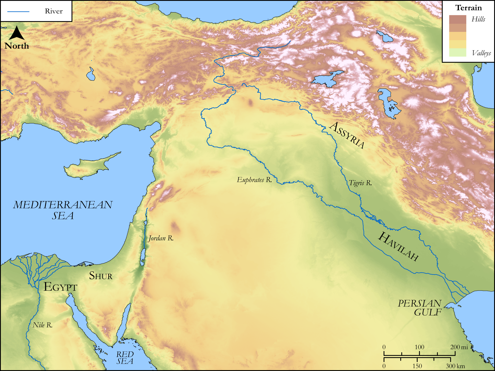

# Biblica Open Bible Maps

## License Information

Biblica Open Bible Maps, © 2023–2025 Biblica, Inc. This work is licensed under Creative Commons Attribution-ShareAlike 4.0 International (<a href="https://creativecommons.org/licenses/by-sa/4.0/">https://creativecommons.org/licenses/by-sa/4.0/</a>). More Information: <a href="https://docs.google.com/document/d/1Pp44yZ0Zdnd59vJHTrt2rPYq0SppfX5rZbPBt6mz37U/edit?tab=t.0#heading=h.oev9aj1ksvk2">https://docs.google.com/document/d/1Pp44yZ0Zdnd59vJHTrt2rPYq0SppfX5rZbPBt6mz37U/edit?tab=t.0#heading=h.oev9aj1ksvk2</a>

--------------------------------

## SRV Genesis: Gen. 25:12–17 (id: OT279)

### Image Content

[link](images/OT279.png)

Original: [SRV Genesis: Gen. 25:12\-17](https://drive.google.com/open?id=1vudnf1ihmluVWYN1PLXFHpsEv6PeUIcX&usp=drive_copy)

* **Associated Passages:** Genesis 25:1-34

* **Associated ACAI Concepts:** Esau (ID: `person:Esau`); Abraham (ID: `person:Abraham`); Isaac (ID: `person:Isaac`); Israel (ID: `person:Israel`); Ishmael (ID: `person:Ishmael`); LORD (ID: `deity:Lord`); Rebekah (ID: `person:Rebekah`); Jokshan (ID: `person:Jokshan`); Keturah (ID: `person:Keturah`); Midian (ID: `person:Midian`); Egypt (ID: `place:Egypt`); Sarah (ID: `person:Sarah`); Heth (ID: `person:Heth`); Medan (ID: `person:Medan`); Stew (ID: `realia:Stew`); Mibsam (ID: `person:Mibsam`); Havilah (ID: `place:Havilah.2`); Sheba (ID: `person:Sheba.3`); Dumah (ID: `person:Dumah`); Jetur (ID: `person:Jetur`); Hanoch (ID: `person:Hanoch`); Hadad (ID: `person:Hadad.4`); Asshurim (ID: `group:Asshurim`); Letushim (ID: `group:Letushim`); Zimran (ID: `person:Zimran`); Adbeel (ID: `person:Adbeel`); Tema (ID: `person:Tema`); Epher (ID: `person:Epher`); Kedemah (ID: `person:Kedemah`); Ishbak (ID: `person:Ishbak`); Naphish (ID: `person:Naphish`); Zohar (ID: `person:Zohar`); Beer-lahai-roi (ID: `place:Beer-lahai-roi`); Paddan-aram (ID: `place:Paddan-aram`); Abida (ID: `person:Abida`); Leummites (ID: `group:Leummim`); Massa (ID: `person:Massa`); Ephron (ID: `person:Ephron.2`); Nebaioth (ID: `person:Nebaioth`); Kedar (ID: `person:Kedar`); Eldaah (ID: `person:Eldaah`); Dedan (ID: `person:Dedan.2`); Ephah (ID: `person:Ephah`); Machpelah (ID: `place:Machpelah`); Mishma (ID: `person:Mishma`); Shuah (ID: `person:Shuah`); Arameans (ID: `group:Aramean`); Mamre (ID: `place:Mamre`); Hagar (ID: `person:Hagar`); Hittites (ID: `group:Hittite`); Assyria (ID: `place:Assyria`); Love (ID: `keyterm:Love`); Bethuel (ID: `person:Bethuel`); Laban (ID: `person:Laban`); Bless (ID: `keyterm:Bless`); Egyptians (ID: `group:Egypt`); Force to Serve (ID: `keyterm:EnticedToServe`); Shur (ID: `place:Shur`); Swear (ID: `keyterm:Swear`); Lentil (ID: `flora:Lentil`); Tent (ID: `realia:Tent`); Clothing (ID: `realia:Clothing`)
