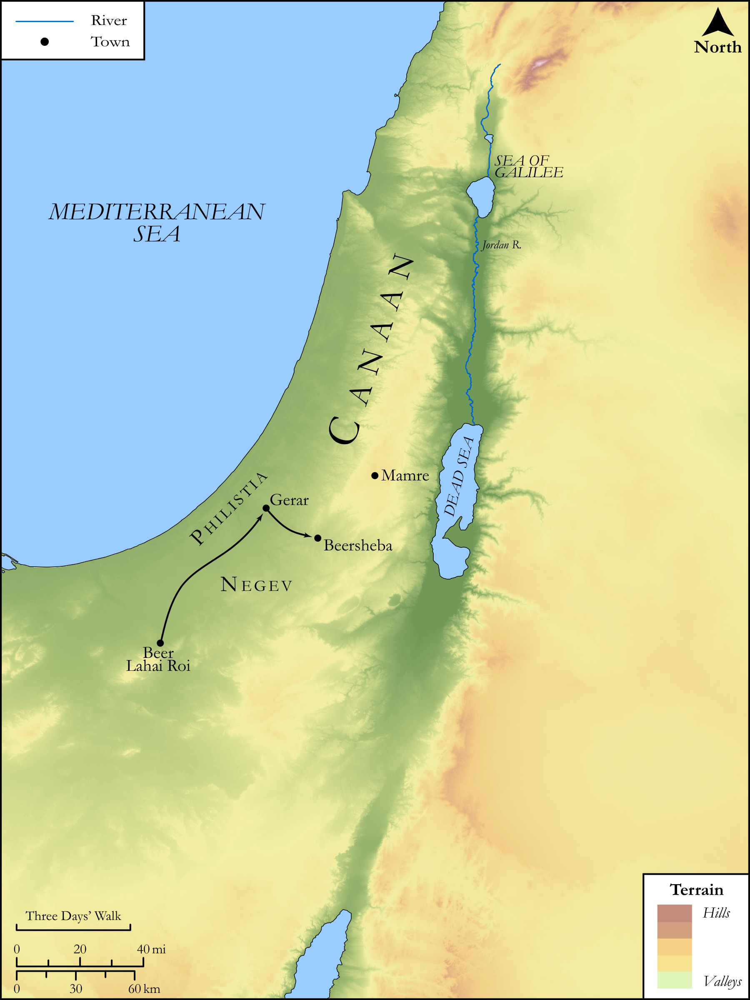

# Biblica Open Bible Maps

## License Information

Biblica Open Bible Maps, © 2023–2025 Biblica, Inc. This work is licensed under Creative Commons Attribution-ShareAlike 4.0 International (<a href="https://creativecommons.org/licenses/by-sa/4.0/">https://creativecommons.org/licenses/by-sa/4.0/</a>). More Information: <a href="https://docs.google.com/document/d/1Pp44yZ0Zdnd59vJHTrt2rPYq0SppfX5rZbPBt6mz37U/edit?tab=t.0#heading=h.oev9aj1ksvk2">https://docs.google.com/document/d/1Pp44yZ0Zdnd59vJHTrt2rPYq0SppfX5rZbPBt6mz37U/edit?tab=t.0#heading=h.oev9aj1ksvk2</a>

--------------------------------

## SRV Genesis: Gen. 26:1–32 (id: OT281)

### Image Content

[link](images/OT281.png)

Original: [SRV Genesis: Gen. 26:1\-32](https://drive.google.com/open?id=1UGZYOsib6uZ0yNfe47_JziMkavvDgET1&usp=drive_copy)

* **Associated Passages:** Genesis 26:1-35

* **Associated ACAI Concepts:** Isaac (ID: `person:Isaac`); Abimelech (ID: `person:Abimelech`); LORD (ID: `deity:Lord`); Abraham (ID: `person:Abraham`); Gerar (ID: `place:Gerar`); Philistines (ID: `group:Philistine`); Bless (ID: `keyterm:Bless`); Philistia (ID: `place:Philistine`); Rebekah (ID: `person:Rebekah`); Peace (ID: `keyterm:IntactState`); Beersheba (ID: `place:Beersheba`); Fear (ID: `keyterm:Fear`); Oath (ID: `keyterm:Oath`); Swear (ID: `keyterm:Swear`); Judith (ID: `person:Judith`); Phicol (ID: `person:Phicol`); Hittites (ID: `group:Hittite`); Esek (ID: `place:Esek`); Rehoboth (ID: `place:Rehoboth`); Beeri (ID: `person:Beeri`); Ahuzzath (ID: `person:Ahuzzath`); Sitnah (ID: `place:Sitnah`); Elon (ID: `person:Elon`); Flock (ID: `fauna:Flock`); Goat (ID: `fauna:Goat`); Be Zealous (ID: `keyterm:Zealous`); Egypt (ID: `place:Egypt`); Adah (ID: `person:Adah.2`); Instruction (ID: `keyterm:Instruction`); Covenant (ID: `keyterm:Covenant`); Heth (ID: `person:Heth`); Esau (ID: `person:Esau`); Sheep (ID: `fauna:Lamb`); Window (ID: `realia:Window`); Cattle (ID: `fauna:Bull`); Temple Altar (ID: `realia:TempleAltar`); Stone Altar (ID: `realia:StoneAltar`); Altar (ID: `realia:Altar`); Tent (ID: `realia:Tent`); Tabernacle Altar (ID: `realia:TabernacleAltar`)
