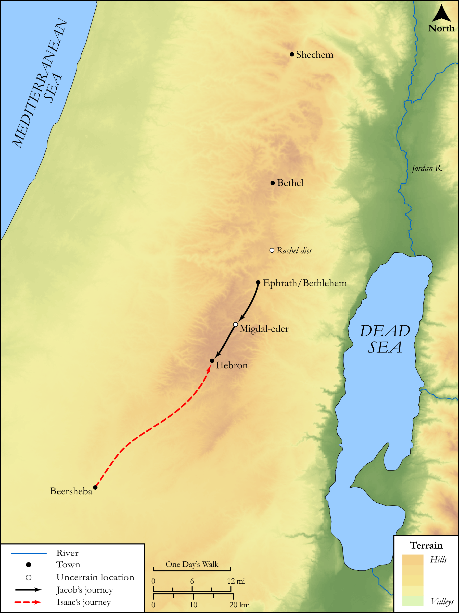

# Biblica Open Bible Maps

## License Information

Biblica Open Bible Maps, © 2023–2025 Biblica, Inc. This work is licensed under Creative Commons Attribution-ShareAlike 4.0 International (<a href="https://creativecommons.org/licenses/by-sa/4.0/">https://creativecommons.org/licenses/by-sa/4.0/</a>). More Information: <a href="https://docs.google.com/document/d/1Pp44yZ0Zdnd59vJHTrt2rPYq0SppfX5rZbPBt6mz37U/edit?tab=t.0#heading=h.oev9aj1ksvk2">https://docs.google.com/document/d/1Pp44yZ0Zdnd59vJHTrt2rPYq0SppfX5rZbPBt6mz37U/edit?tab=t.0#heading=h.oev9aj1ksvk2</a>

--------------------------------

## SRV Genesis: Gen. 35:21–28 (id: OT286)

### Image Content

[link](images/OT286.png)

Original: [SRV Genesis: Gen. 35:21\-28](https://drive.google.com/open?id=1rflID6EMfcljxDZJliJ8r39U-yq8HlVF&usp=drive_copy)

* **Associated Passages:** Genesis 35:1-29

* **Associated ACAI Concepts:** Israel (ID: `person:Israel`); LORD (ID: `deity:Lord`); Bethel (ID: `place:Bethel`); Rachel (ID: `person:Rachel`); Isaac (ID: `person:Isaac`); Benjamin (ID: `person:Benjamin`); Bethlehem (ID: `place:Bethlehem`); Reuben (ID: `person:Reuben`); Temple Altar (ID: `realia:TempleAltar`); Stone Altar (ID: `realia:StoneAltar`); Altar (ID: `realia:Altar`); Tabernacle Altar (ID: `realia:TabernacleAltar`); Leah (ID: `person:Leah`); Abraham (ID: `person:Abraham`); Paddan-aram (ID: `place:Paddan-aram`); Bilhah (ID: `person:Bilhah`); Esau (ID: `person:Esau`); Mamre (ID: `place:Mamre`); Deborah (ID: `person:Deborah`); Tower of Eder (ID: `place:TowerOfEder`); Judah (ID: `person:Judah.4`); Allon-bachuth (ID: `place:Allon-bacuth`); A Midwife (ID: `person:GenericMidwife`); Dan (ID: `person:Dan`); Asher (ID: `person:Asher`); Zilpah (ID: `person:Zilpah`); Offering (ID: `keyterm:Offering`); Rebekah (ID: `person:Rebekah`); Gad (ID: `person:Gad`); Joseph (ID: `person:Joseph.10`); Simeon (ID: `person:Simeon.5`); Issachar (ID: `person:Issachar`); Naphtali (ID: `person:Naphtali`); Pure (ID: `keyterm:Pure`); Hebron (ID: `place:Hebron`); Levi (ID: `person:Levi.3`); Fear (ID: `keyterm:Fear`); Bless (ID: `keyterm:Bless`); Shechem (ID: `place:Shechem`); Canaan (ID: `place:Canaan`); Zebulun (ID: `person:Zebulun`); Terebinth (ID: `flora:Terebinth`); Anointing Oil (ID: `realia:AnointingOil`); Oak (ID: `flora:Oak`); Earring (ID: `realia:Earring`); Tent (ID: `realia:Tent`); Wine (ID: `realia:Wine`); Olive Oil (ID: `realia:OliveOil`)
