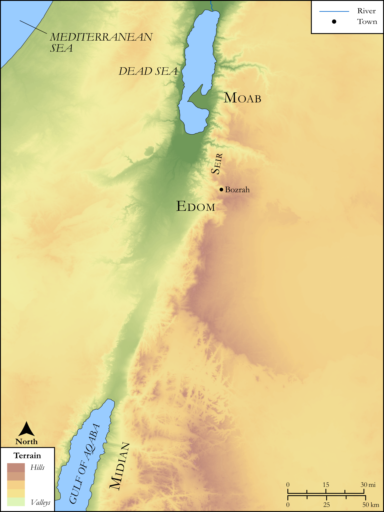

# Biblica Open Bible Maps

## License Information

Biblica Open Bible Maps, © 2023–2025 Biblica, Inc. This work is licensed under Creative Commons Attribution-ShareAlike 4.0 International (<a href="https://creativecommons.org/licenses/by-sa/4.0/">https://creativecommons.org/licenses/by-sa/4.0/</a>). More Information: <a href="https://docs.google.com/document/d/1Pp44yZ0Zdnd59vJHTrt2rPYq0SppfX5rZbPBt6mz37U/edit?tab=t.0#heading=h.oev9aj1ksvk2">https://docs.google.com/document/d/1Pp44yZ0Zdnd59vJHTrt2rPYq0SppfX5rZbPBt6mz37U/edit?tab=t.0#heading=h.oev9aj1ksvk2</a>

--------------------------------

## SRV Genesis: Gen. 36:31–42 (id: OT288)

### Image Content

[link](images/OT288.png)

Original: [SRV Genesis: Gen. 36:31\-42](https://drive.google.com/open?id=11tWbuytN9vixEZvJvYPB8uC-m-wGAywG&usp=drive_copy)

* **Associated Passages:** Genesis 36:1-43

* **Associated ACAI Concepts:** Esau (ID: `person:Esau`); Edom (ID: `place:Edom`); Eliphaz (ID: `person:Eliphaz`); Adah (ID: `person:Adah.2`); Mahalath (ID: `person:Mahalath`); Hori (ID: `person:Hori`); Reuel (ID: `person:Reuel.3`); Oholibamah (ID: `person:Oholibamah`); Zibeon (ID: `person:Zibeon.2`); Jeush (ID: `person:Jeush`); Jalam (ID: `person:Jalam`); Anah (ID: `person:Anah`); Korah (ID: `person:Korah`); Edomites (ID: `group:Edom`); Anah (ID: `person:Anah.2`); Dishan (ID: `person:Dishan`); Dishon (ID: `person:Dishon`); Shobal (ID: `person:Shobal`); Teman (ID: `person:Teman`); Ezer (ID: `person:Ezer`); Lotan (ID: `person:Lotan`); Seir (ID: `place:Seir`); Horites (ID: `group:Hori`); Canaan (ID: `place:Canaan`); Baal-hanan (ID: `person:Baal-hanan`); Zepho (ID: `person:Zepho`); Gatam (ID: `person:Gatam`); Amalek (ID: `person:Amalek`); Bela (ID: `person:Bela.2`); Zibeon (ID: `person:Zibeon`); Shammah (ID: `person:Shammah.2`); Hadad (ID: `person:Hadad`); Zerah (ID: `person:Zerah`); Samlah (ID: `person:Samlah`); Jobab (ID: `person:Jobab.2`); Seir (ID: `person:Seir`); Mizzah (ID: `person:Mizzah`); Achbor (ID: `person:Achbor`); Husham (ID: `person:Husham`); Kenaz (ID: `person:Kenaz`); Omar (ID: `person:Omar`); Nahath (ID: `person:Nahath`); Shaul (ID: `person:Shaul`); Israel (ID: `person:Israel`); Zerah (ID: `person:Zerah.2`); Uz (ID: `person:Uz.3`); Masrekah (ID: `place:Masrekah`); Aran (ID: `person:Aran`); Mezahab (ID: `person:Mezahab`); Hemdan (ID: `person:Hemdan`); Pinon (ID: `person:Pinon`); Akan (ID: `person:Akan`); Korah (ID: `person:Korah.2`); Zaavan (ID: `person:Zaavan`); Manahath (ID: `person:Manahath`); Cheran (ID: `person:Cheran`); Jetheth (ID: `person:Jetheth`); Alvah (ID: `person:Alvah`); Mehetabel (ID: `person:Mehetabel`); Matred (ID: `person:Matred`); Timna (ID: `person:Timna`); Beor (ID: `person:Beor`); Anah (ID: `person:Anah.3`); Pau (ID: `place:Pau`); Timna (ID: `person:Timna.2`); Magdiel (ID: `person:Magdiel`); Alvan (ID: `person:Alvan`); Bedad (ID: `person:Bedad`); Elon (ID: `person:Elon`); Timna (ID: `person:Timna.3`); Eshban (ID: `person:Eshban`); Dinhabah (ID: `place:Dinhabah`); Bilhan (ID: `person:Bilhan`); Kenaz (ID: `person:Kenaz.2`); Ithran (ID: `person:Ithran`); Onam (ID: `person:Onam`); Iram (ID: `person:Iram`); Rehoboth (ID: `place:Rehoboth.2`); Mibzar (ID: `person:Mibzar`); Shepho (ID: `person:Shepho`); Dishon (ID: `person:Dishon.2`); Oholibamah (ID: `person:Oholibamah.2`); Oholibamah (ID: `person:Oholibamah.3`); Avith (ID: `place:Avith`); Hadad (ID: `person:Hadad.2`); Elah (ID: `person:Elah`); Aiah (ID: `person:Aiah`); Hemam (ID: `person:Hemam`); Ebal (ID: `person:Ebal`); Hittites (ID: `group:Hittite`); Midian (ID: `place:Midian`); Ishmael (ID: `person:Ishmael`); Israelites (ID: `group:Israel`); Teman (ID: `place:Teman`); Temanites (ID: `group:Teman`); Moab (ID: `place:Moab`); Hivites (ID: `group:Hivites`); Euphrates River (ID: `place:Euphrates`); Bozrah (ID: `place:Bozrah.2`); Nebaioth (ID: `person:Nebaioth`); Heth (ID: `person:Heth`); Cattle (ID: `fauna:Bull`); Sheep (ID: `fauna:Lamb`); Donkey (ID: `fauna:Donkey`)
