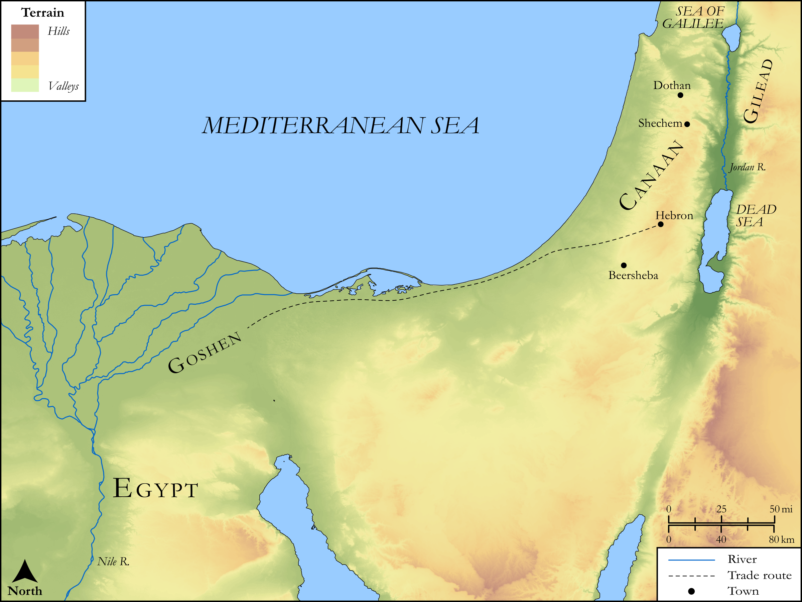

# Biblica Open Bible Maps

## License Information

Biblica Open Bible Maps, © 2023–2025 Biblica, Inc. This work is licensed under Creative Commons Attribution-ShareAlike 4.0 International (<a href="https://creativecommons.org/licenses/by-sa/4.0/">https://creativecommons.org/licenses/by-sa/4.0/</a>). More Information: <a href="https://docs.google.com/document/d/1Pp44yZ0Zdnd59vJHTrt2rPYq0SppfX5rZbPBt6mz37U/edit?tab=t.0#heading=h.oev9aj1ksvk2">https://docs.google.com/document/d/1Pp44yZ0Zdnd59vJHTrt2rPYq0SppfX5rZbPBt6mz37U/edit?tab=t.0#heading=h.oev9aj1ksvk2</a>

--------------------------------

## SRV Genesis: Gen. 37:12–36, Gen. 39:1–23, Gen. 42:1–26, Gen. 42:27–38, Gen. 43:1–34, Gen. 45:1–28, Gen. 46:1–27, Gen. 46:28–47:12, Gen. 47:27–31, Gen. 49:29–50:14, Gen. 50:15–21, Gen. 50:22–25 (id: OT289)

### Image Content

[link](images/OT289.png)

Original: [SRV Genesis: Gen. 37:12\-36, Gen. 39:1\-23, Gen. 42:1\-26, Gen. 42:27\-38, Gen. 43:1\-34, Gen. 45:1\-28, Gen. 46:1\-27, Gen. 46:28\-47:12, Gen. 47:27\-31, Gen. 49:29\-50:14, Gen. 50:15\-21, Gen. 50:22\-25](https://drive.google.com/open?id=196gbMM_aoFfg_JwdJJPgBjzJufRFAAcY&usp=drive_copy)

* **Associated Passages:** Genesis 37:1-36

* **Associated ACAI Concepts:** Joseph (ID: `person:Joseph.10`); Israel (ID: `person:Israel`); Tunic (ID: `realia:Tunic.2`); Pit (ID: `realia:Pit`); Ishmaelites (ID: `group:Ishmael`); Reuben (ID: `person:Reuben`); Sheep (ID: `fauna:Lamb`); Flock (ID: `fauna:Flock`); Goat (ID: `fauna:Goat`); Egypt (ID: `place:Egypt`); Ishmael (ID: `person:Ishmael`); Shechem (ID: `place:Shechem`); Peace (ID: `keyterm:IntactState`); Midianites (ID: `group:Midian`); Midian (ID: `place:Midian`); Love (ID: `keyterm:Love`); Potiphar (ID: `person:Potiphar`); Gilead (ID: `place:Gilead`); Dothan (ID: `place:Dothan`); Valley of Hebron (ID: `place:HebronValley`); Jackal (ID: `fauna:Jackal`); Hyena (ID: `fauna:Hyena`); Bear (ID: `fauna:Bear`); Lion (ID: `fauna:Lion`); Be Zealous (ID: `keyterm:Zealous`); Pharaoh (ID: `person:Pharaoh.4`); Hell (ID: `place:Hell`); A Man (ID: `person:GenericMale`); Zilpah (ID: `person:Zilpah`); Judah (ID: `person:Judah.4`); Bilhah (ID: `person:Bilhah`); Canaan (ID: `place:Canaan`); Liquidambar (ID: `flora:Liquidambar`); Gum Tragacanth (ID: `flora:GumTragacanth`); Rock Rose (ID: `flora:Ladanum`); Sheaf (ID: `realia:Sheaf`); Sackcloth (ID: `realia:Sackcloth`); Camel (ID: `fauna:Camel`); Money (ID: `realia:Money`)
