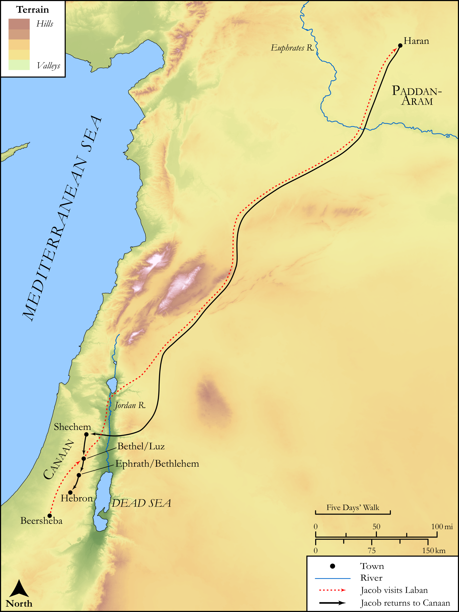

# Biblica Open Bible Maps

## License Information

Biblica Open Bible Maps, © 2023–2025 Biblica, Inc. This work is licensed under Creative Commons Attribution-ShareAlike 4.0 International (<a href="https://creativecommons.org/licenses/by-sa/4.0/">https://creativecommons.org/licenses/by-sa/4.0/</a>). More Information: <a href="https://docs.google.com/document/d/1Pp44yZ0Zdnd59vJHTrt2rPYq0SppfX5rZbPBt6mz37U/edit?tab=t.0#heading=h.oev9aj1ksvk2">https://docs.google.com/document/d/1Pp44yZ0Zdnd59vJHTrt2rPYq0SppfX5rZbPBt6mz37U/edit?tab=t.0#heading=h.oev9aj1ksvk2</a>

--------------------------------

## SRV Genesis: Gen. 48:1–21 (id: OT292)

### Image Content

[link](images/OT292.png)

Original: [SRV Genesis: Gen. 48:1\-21](https://drive.google.com/open?id=1u0P3BCSF5kLYMujDvIFko7cjwUdy1s7Z&usp=drive_copy)

* **Associated Passages:** Genesis 48:1-22

* **Associated ACAI Concepts:** Joseph (ID: `person:Joseph.10`); Israel (ID: `person:Israel`); Manasseh (ID: `person:Manasseh`); Ephraim (ID: `person:Ephraim`); LORD (ID: `deity:Lord`); Bless (ID: `keyterm:Bless`); Abraham (ID: `person:Abraham`); Isaac (ID: `person:Isaac`); Canaan (ID: `place:Canaan`); Paddan-aram (ID: `place:Paddan-aram`); Egypt (ID: `place:Egypt`); Amorites (ID: `group:Amorites`); Bethlehem (ID: `place:Bethlehem`); Rachel (ID: `person:Rachel`); Simeon (ID: `person:Simeon.5`); Reuben (ID: `person:Reuben`); To Cause to Possess (ID: `keyterm:Possess`); Bethel (ID: `place:Bethel`); An Angel (ID: `deity:Angel`); Sheep (ID: `fauna:Lamb`); Sword (ID: `realia:Sword`); Bed (ID: `realia:Bed`); Bow (ID: `realia:Bow`); Flock (ID: `fauna:Flock`); Goat (ID: `fauna:Goat`)
