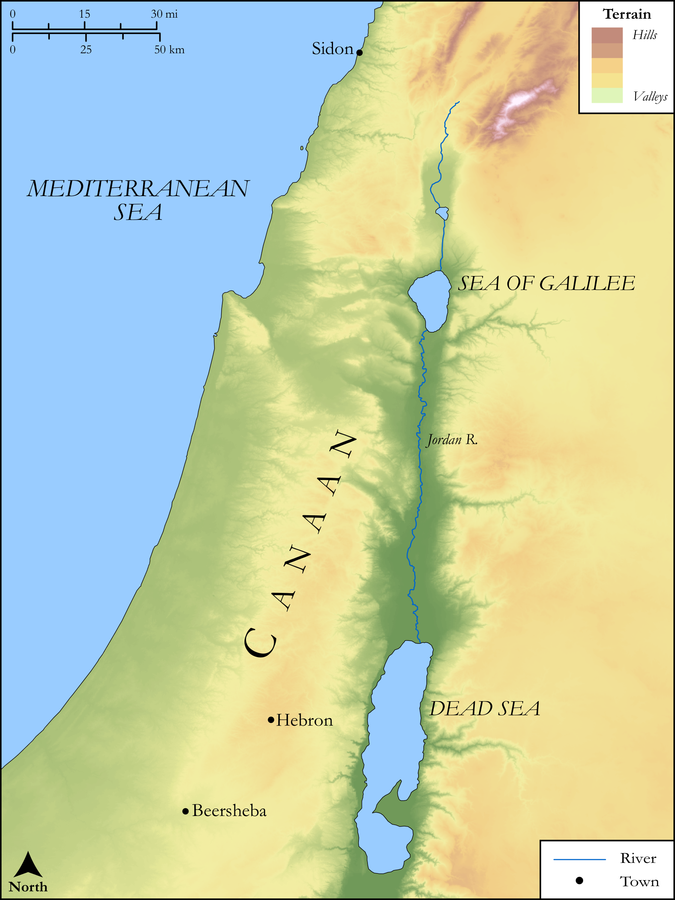

# Biblica Open Bible Maps

## License Information

Biblica Open Bible Maps, © 2023–2025 Biblica, Inc. This work is licensed under Creative Commons Attribution-ShareAlike 4.0 International (<a href="https://creativecommons.org/licenses/by-sa/4.0/">https://creativecommons.org/licenses/by-sa/4.0/</a>). More Information: <a href="https://docs.google.com/document/d/1Pp44yZ0Zdnd59vJHTrt2rPYq0SppfX5rZbPBt6mz37U/edit?tab=t.0#heading=h.oev9aj1ksvk2">https://docs.google.com/document/d/1Pp44yZ0Zdnd59vJHTrt2rPYq0SppfX5rZbPBt6mz37U/edit?tab=t.0#heading=h.oev9aj1ksvk2</a>

--------------------------------

## SRV Genesis: Gen. 49:1–27 (id: OT293)

### Image Content

[link](images/OT293.png)

Original: [SRV Genesis: Gen. 49:1\-27](https://drive.google.com/open?id=1Dip_L8g2SnMzL-4Vk8eOFgHGdJM3h8in&usp=drive_copy)

* **Associated Passages:** Genesis 49:1-33

* **Associated ACAI Concepts:** Israel (ID: `person:Israel`); Judah (ID: `person:Judah.4`); Bless (ID: `keyterm:Bless`); Heth (ID: `person:Heth`); Dan (ID: `person:Dan`); LORD (ID: `deity:Lord`); Abraham (ID: `person:Abraham`); Hittites (ID: `group:Hittite`); Joseph (ID: `person:Joseph.10`); Ephron (ID: `person:Ephron.2`); Machpelah (ID: `place:Machpelah`); Asher (ID: `person:Asher`); Leah (ID: `person:Leah`); Sidon (ID: `place:Sidon`); Rebekah (ID: `person:Rebekah`); Gad (ID: `person:Gad`); Simeon (ID: `person:Simeon.5`); Issachar (ID: `person:Issachar`); Shiloh (ID: `person:Shiloh`); Zebulun (ID: `person:Zebulun`); Donkey (ID: `fauna:Donkey`); Wine (ID: `realia:Wine`); Bed (ID: `realia:Bed`); Vine (ID: `flora:Vine`); Mamre (ID: `place:Mamre`); Salvation (ID: `keyterm:Salvation`); Benjamin (ID: `person:Benjamin`); Sarah (ID: `person:Sarah`); Naphtali (ID: `person:Naphtali`); Delight (ID: `keyterm:Delight`); Levi (ID: `person:Levi.3`); Strength (ID: `keyterm:Strength`); Reuben (ID: `person:Reuben`); Force to Serve (ID: `keyterm:EnticedToServe`); Isaac (ID: `person:Isaac`); To Curse (ID: `keyterm:Curse`); Arrow (ID: `keyterm:Arrow`); To Dishonor (ID: `keyterm:Dishonor`); Canaan (ID: `place:Canaan`); Viper (ID: `fauna:Viper`); Lion (ID: `fauna:Lion`); Staff (ID: `realia:Staff`); Rod (ID: `realia:Rod`); Sheep (ID: `fauna:Lamb`); Deer (ID: `fauna:Deer`); Cattle (ID: `fauna:Bull`); Sword (ID: `realia:Sword`); Snake (ID: `fauna:Snake`); Sheepfold (ID: `realia:Sheepfold`); Arrow (ID: `realia:Arrow`); Bow (ID: `realia:Bow`); Wolf (ID: `fauna:Wolf`); Horse (ID: `fauna:Horse`); Ship (ID: `realia:Ship`); Flock (ID: `fauna:Flock`); Goat (ID: `fauna:Goat`)
