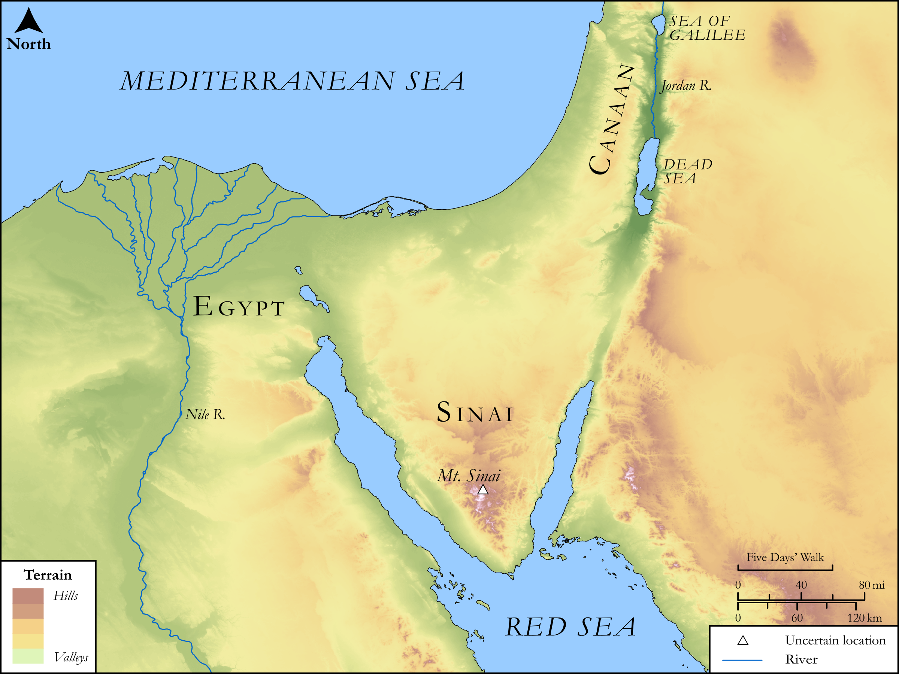

# Biblica Open Bible Maps

## License Information

Biblica Open Bible Maps, © 2023–2025 Biblica, Inc. This work is licensed under Creative Commons Attribution-ShareAlike 4.0 International (<a href="https://creativecommons.org/licenses/by-sa/4.0/">https://creativecommons.org/licenses/by-sa/4.0/</a>). More Information: <a href="https://docs.google.com/document/d/1Pp44yZ0Zdnd59vJHTrt2rPYq0SppfX5rZbPBt6mz37U/edit?tab=t.0#heading=h.oev9aj1ksvk2">https://docs.google.com/document/d/1Pp44yZ0Zdnd59vJHTrt2rPYq0SppfX5rZbPBt6mz37U/edit?tab=t.0#heading=h.oev9aj1ksvk2</a>

--------------------------------

## SRV Exodus: Exod. 3:11–22, Exod. 23:1–9, Exod. 23:10–18 (id: OT305)

### Image Content

[link](images/OT305.png)

Original: [SRV Exodus: Exod. 3:11\-22, Exod. 23:1\-9, Exod. 23:10\-18](https://drive.google.com/open?id=13Ok6aqfCUXSdWvsVr0lRSpry7W0vetTL&usp=drive_copy)

* **Associated Passages:** Exodus 3:1-22

* **Associated ACAI Concepts:** Egypt (ID: `place:Egypt`); LORD (ID: `deity:Lord`); Israel (ID: `person:Israel`); Moses (ID: `person:Moses`); Egyptians (ID: `group:Egypt`); Abraham (ID: `person:Abraham`); Isaac (ID: `person:Isaac`); Bush (ID: `flora:Bush`); Land Flowing of Milk and Honey (ID: `keyterm:LandFlowingOfMilkAndHoney`); Perizzites (ID: `group:Perizzites`); Heth (ID: `person:Heth`); Amorites (ID: `group:Amorites`); Hittites (ID: `group:Hittite`); Canaanites (ID: `group:Canaan`); Jebusites (ID: `group:Jebusites`); Pharaoh (ID: `person:Pharaoh.6`); Hivites (ID: `group:Hivites`); Canaan (ID: `place:Canaan`); Mount Sinai (ID: `place:SinaiMount`); Midian (ID: `place:Midian`); Jethro (ID: `person:Jethro`); Favor (ID: `keyterm:Favor`); Hebrews (ID: `group:Hebrews`); Fear (ID: `keyterm:Fear`); Force to Serve (ID: `keyterm:EnticedToServe`); Appoint (ID: `keyterm:Appoint`); Holy (ID: `keyterm:Holy`); An Angel (ID: `deity:Angel`); Sheep (ID: `fauna:Lamb`); House (ID: `realia:House`); Money (ID: `realia:Money`); Cloak (ID: `realia:Cloak`); Flock (ID: `fauna:Flock`); Goat (ID: `fauna:Goat`)
