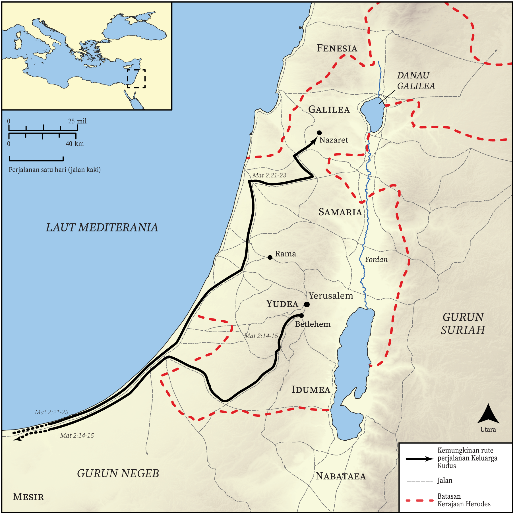

# Peta Alkitab Terbuka Biblica

## License Information

Biblica Open Bible Maps, © 2023–2025 Biblica, Inc. This work is licensed under Creative Commons Attribution-ShareAlike 4.0 International (https://creativecommons.org/licenses/by-sa/4.0/). More Information: https://docs.google.com/document/d/1Pp44yZ0Zdnd59vJHTrt2rPYq0SppfX5rZbPBt6mz37U/edit?tab=t.0#heading=h.oev9aj1ksvk2

--------------------------------

## Kehidupan Yesus: Kelahiran Yesus (id: NT010)

### Image Content

[link](images/NT010.png)

* **Associated Passages:** Matius 2:1-23; Lukas 2:1-52

* **Associated ACAI Concepts:** Tuhan (ID: `deity:Lord`); Herodes (ID: `person:Herod`); Yesus (ID: `person:Jesus.2`); Yerusalem (ID: `place:Jerusalem`); Betlehem (ID: `place:Bethlehem`); An Angel (ID: `deity:Angel`); firman (ID: `keyterm:Word`); Israel (ID: `person:Israel`); Maria (ID: `person:Mary`); hukum (ID: `keyterm:Law`); Nazaret (ID: `place:Nazareth`); Mesir (ID: `place:Egypt`); Yusuf (ID: `person:Joseph.4`); kemuliaan (ID: `keyterm:Glory`); Yehuda (ID: `place:Judea`); Goat (ID: `fauna:Goat`); Flock (ID: `fauna:Flock`); menyembah (ID: `keyterm:BowDown`); Galilea (ID: `place:Galilee`); Roh (ID: `deity:HolySpirit`); hati (ID: `keyterm:Heart`); menggenapi (ID: `keyterm:Happen`); takut (ID: `keyterm:Fear`); mendaftarkan (ID: `keyterm:Register`); Sheep (ID: `fauna:Lamb`); Simeon (ID: `person:Simeon.2`); Cause of Joy (ID: `keyterm:CauseOfJoy`); meminta (ID: `keyterm:AskFor`); kebaikan (ID: `keyterm:Favor`); persembahan (ID: `keyterm:Offering`)
