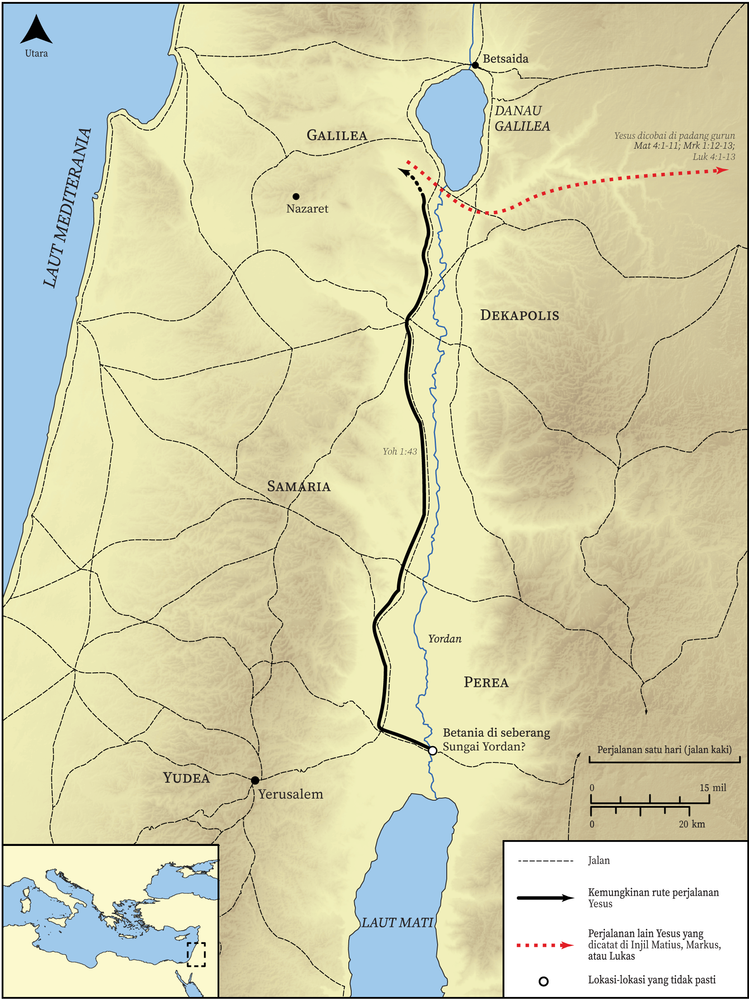

# Peta Alkitab Terbuka Biblica

## License Information

Biblica Open Bible Maps, © 2023–2025 Biblica, Inc. This work is licensed under Creative Commons Attribution-ShareAlike 4.0 International (<a href="https://creativecommons.org/licenses/by-sa/4.0/">https://creativecommons.org/licenses/by-sa/4.0/</a>). More Information: <a href="https://docs.google.com/document/d/1Pp44yZ0Zdnd59vJHTrt2rPYq0SppfX5rZbPBt6mz37U/edit?tab=t.0#heading=h.oev9aj1ksvk2">https://docs.google.com/document/d/1Pp44yZ0Zdnd59vJHTrt2rPYq0SppfX5rZbPBt6mz37U/edit?tab=t.0#heading=h.oev9aj1ksvk2</a>

--------------------------------

## Kehidupan Yesus: Yesus Dibaptis dan Pergi ke Galilea (id: NT011)

### Image Content

[link](images/NT011.png)

* **Associated Passages:** Yohanes 1:1-51

* **Associated ACAI Concepts:** Yesus (ID: `person:Jesus.2`); Tuhan (ID: `deity:Lord`); Yohanes (ID: `person:John`); bersaksi (ID: `keyterm:BearWitness`); Natanael (ID: `person:Nathanael`); Filipus (ID: `person:Philip`); baptisan (ID: `keyterm:Baptism`); keahlian (ID: `keyterm:Ability`); Petrus (ID: `person:Peter`); kebaikan (ID: `keyterm:Favor`); meminta (ID: `keyterm:AskFor`); Israel (ID: `person:Israel`); percaya (ID: `keyterm:Believe`); benar (ID: `keyterm:True`); Nazaret (ID: `place:Nazareth`); Andreas (ID: `person:Andrew`); hukum (ID: `keyterm:Law`); Musa (ID: `person:Moses`); menjadi murid (ID: `keyterm:Disciple`); sorga (ID: `keyterm:Heaven`); Elia (ID: `person:Elijah`); nama (ID: `keyterm:Name`); kebenaran (ID: `keyterm:Truth`); tubuh (ID: `keyterm:Body.3`); Roh (ID: `deity:HolySpirit`); Betania (ID: `place:Bethany.2`); A Disciple (ID: `person:GenericDisciple`); Yohanes (ID: `person:John.4`); kehidupan (ID: `keyterm:Life`); Betsaida (ID: `place:Bethsaida`)
