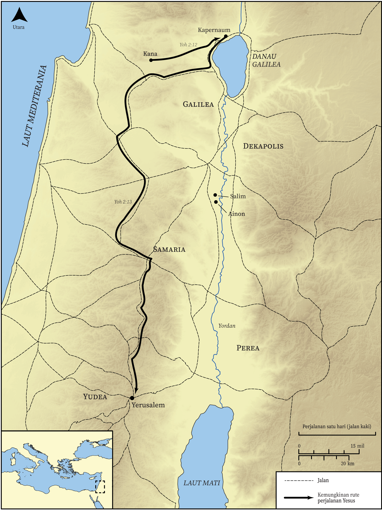

# Peta Alkitab Terbuka Biblica

## License Information

Biblica Open Bible Maps, © 2023–2025 Biblica, Inc. This work is licensed under Creative Commons Attribution-ShareAlike 4.0 International (https://creativecommons.org/licenses/by-sa/4.0/). More Information: https://docs.google.com/document/d/1Pp44yZ0Zdnd59vJHTrt2rPYq0SppfX5rZbPBt6mz37U/edit?tab=t.0#heading=h.oev9aj1ksvk2

--------------------------------

## Kehidupan Yesus: Perjalanan Pertama Yesus dari Galilea ke Yerusalem (id: NT012)

### Image Content

[link](images/NT012.png)

* **Associated Passages:** Yohanes 2:1-3:36

* **Associated ACAI Concepts:** Yesus (ID: `person:Jesus.2`); Tuhan (ID: `deity:Lord`); percaya (ID: `keyterm:Believe`); Jews (ID: `group:Jews`); menjadi murid (ID: `keyterm:Disciple`); bersaksi (ID: `keyterm:BearWitness`); Yohanes (ID: `person:John`); Temple (ID: `realia:Temple`); tanda (ID: `keyterm:Example`); Roh (ID: `deity:HolySpirit`); selama, lamanya (ID: `keyterm:Always`); amin! (ID: `keyterm:Surely`); kasihi (ID: `keyterm:Love`); sorga (ID: `keyterm:Heaven`); Nikodemus (ID: `person:Nicodemus`); baptisan (ID: `keyterm:Baptism`); keahlian (ID: `keyterm:Ability`); nama (ID: `keyterm:Name`); kehidupan (ID: `keyterm:Life`); Kana (ID: `place:Cana`); kerajaan (ID: `keyterm:Kingdom`); Galilea (ID: `place:Galilee`); tubuh (ID: `keyterm:Body.3`); paskah (ID: `keyterm:Passover`); membersihkan (ID: `keyterm:Cleanse.2`); Yerusalem (ID: `place:Jerusalem`); memutuskan (ID: `keyterm:Decided`); Wine (ID: `realia:Wine`); Stone Jar (ID: `realia:StoneJar`); Salim (ID: `place:Salim`)
