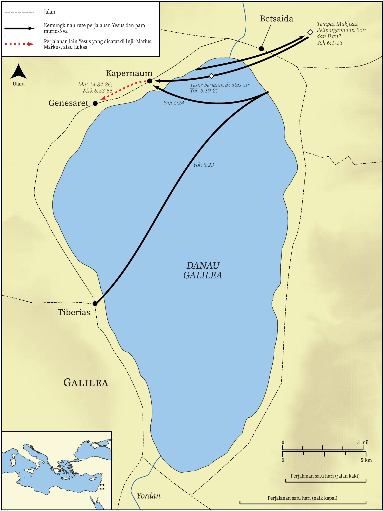

# Peta Alkitab Terbuka Biblica

## License Information

Biblica Open Bible Maps, © 2023–2025 Biblica, Inc. This work is licensed under Creative Commons Attribution-ShareAlike 4.0 International (<a href="https://creativecommons.org/licenses/by-sa/4.0/">https://creativecommons.org/licenses/by-sa/4.0/</a>). More Information: <a href="https://docs.google.com/document/d/1Pp44yZ0Zdnd59vJHTrt2rPYq0SppfX5rZbPBt6mz37U/edit?tab=t.0#heading=h.oev9aj1ksvk2">https://docs.google.com/document/d/1Pp44yZ0Zdnd59vJHTrt2rPYq0SppfX5rZbPBt6mz37U/edit?tab=t.0#heading=h.oev9aj1ksvk2</a>

--------------------------------

## Kehidupan Yesus: Yesus Memberi Makan 5000 Orang dan Berjalan di Atas Air (id: NT015)

### Image Content

[link](images/NT015.png)

* **Associated Passages:** Yohanes 6:1-71

* **Associated ACAI Concepts:** Yesus (ID: `person:Jesus.2`); Tuhan (ID: `deity:Lord`); kehidupan (ID: `keyterm:Life`); menjadi murid (ID: `keyterm:Disciple`); sorga (ID: `keyterm:Heaven`); percaya (ID: `keyterm:Believe`); tubuh (ID: `keyterm:Body.3`); selama, lamanya (ID: `keyterm:Always`); Ship (ID: `realia:Ship`); amin! (ID: `keyterm:Surely`); tanda (ID: `keyterm:Example`); darah (ID: `keyterm:Blood`); Kapernaum (ID: `place:Capernaum`); keahlian (ID: `keyterm:Ability`); Jews (ID: `group:Jews`); Filipus (ID: `person:Philip`); Petrus (ID: `person:Peter`); takut (ID: `keyterm:Fear`); benar (ID: `keyterm:True`); firman (ID: `keyterm:Word`); Sea of Galilee (ID: `place:GalileeSea`); Simon (ID: `person:Simon.7`); Tiberias (ID: `place:Tiberias`); Musa (ID: `person:Moses`); khusus (ID: `keyterm:Holy`); A Group of People (ID: `group:GenericGroup`); A Group of Disciples (ID: `group:GenericDisciples`); Yusuf (ID: `person:Joseph.4`); roh (ID: `keyterm:Spirit.2`); Yudas (ID: `person:Judas.2`)
