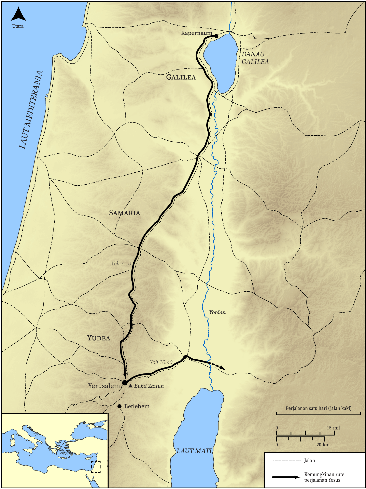

# Peta Alkitab Terbuka Biblica

## License Information

Biblica Open Bible Maps, © 2023–2025 Biblica, Inc. This work is licensed under Creative Commons Attribution-ShareAlike 4.0 International (https://creativecommons.org/licenses/by-sa/4.0/). More Information: https://docs.google.com/document/d/1Pp44yZ0Zdnd59vJHTrt2rPYq0SppfX5rZbPBt6mz37U/edit?tab=t.0#heading=h.oev9aj1ksvk2

--------------------------------

## Kehidupan Yesus: Perjalanan Ketiga Yesus dari Galilea ke Yerusalem (id: NT016)

### Image Content

[link](images/NT016.png)

* **Associated Passages:** Yohanes 7:1-10:42

* **Associated ACAI Concepts:** Yesus (ID: `person:Jesus.2`); Tuhan (ID: `deity:Lord`); percaya (ID: `keyterm:Believe`); Jews (ID: `group:Jews`); benar (ID: `keyterm:True`); Pharisees (ID: `group:Pharisee`); berbuat dosa (ID: `keyterm:Sin`); keahlian (ID: `keyterm:Ability`); Abraham (ID: `person:Abraham`); A Group of People (ID: `group:GenericGroup`); kehidupan (ID: `keyterm:Life`); hukum (ID: `keyterm:Law`); memutuskan (ID: `keyterm:Decided`); bersaksi (ID: `keyterm:BearWitness`); Musa (ID: `person:Moses`); Demons (ID: `deity:Demons`); selama, lamanya (ID: `keyterm:Always`); menjadi murid (ID: `keyterm:Disciple`); meminta (ID: `keyterm:AskFor`); amin! (ID: `keyterm:Surely`); kemuliaan (ID: `keyterm:Glory`); kebenaran (ID: `keyterm:Truth`); Sheep (ID: `fauna:Lamb`); Galilea (ID: `place:Galilee`); sabat (ID: `keyterm:Sabbath`); Temple (ID: `realia:Temple`); Goat (ID: `fauna:Goat`); Flock (ID: `fauna:Flock`); A Blind Man (ID: `person:BlindMan`); firman (ID: `keyterm:Word`)
