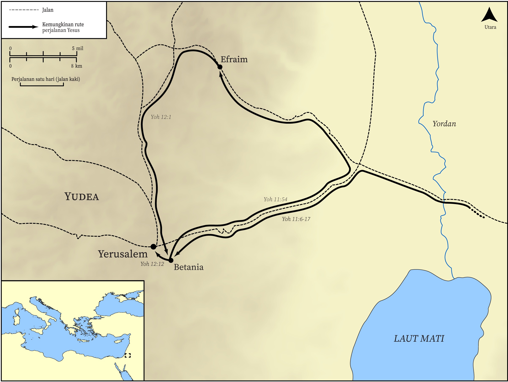

# Peta Alkitab Terbuka Biblica

## License Information

Biblica Open Bible Maps, © 2023–2025 Biblica, Inc. This work is licensed under Creative Commons Attribution-ShareAlike 4.0 International (<a href="https://creativecommons.org/licenses/by-sa/4.0/">https://creativecommons.org/licenses/by-sa/4.0/</a>). More Information: <a href="https://docs.google.com/document/d/1Pp44yZ0Zdnd59vJHTrt2rPYq0SppfX5rZbPBt6mz37U/edit?tab=t.0#heading=h.oev9aj1ksvk2">https://docs.google.com/document/d/1Pp44yZ0Zdnd59vJHTrt2rPYq0SppfX5rZbPBt6mz37U/edit?tab=t.0#heading=h.oev9aj1ksvk2</a>

--------------------------------

## Kehidupan Yesus: Perjalanan Terakhir Yesus ke Yerusalem dalam Injil Yohanes (id: NT017)

### Image Content

[link](images/NT017.png)

* **Associated Passages:** Yohanes 11:1-12:50

* **Associated ACAI Concepts:** Yesus (ID: `person:Jesus.2`); percaya (ID: `keyterm:Believe`); Tuhan (ID: `deity:Lord`); Lazarus (ID: `person:Lazarus.2`); Jews (ID: `group:Jews`); Marta (ID: `person:Martha`); Maria (ID: `person:Mary.3`); keahlian (ID: `keyterm:Ability`); kemuliaan (ID: `keyterm:Glory`); menjadi murid (ID: `keyterm:Disciple`); kebangkitan (ID: `keyterm:Resurrection`); Pharisees (ID: `group:Pharisee`); Yerusalem (ID: `place:Jerusalem`); kehidupan (ID: `keyterm:Life`); selama, lamanya (ID: `keyterm:Always`); Betania (ID: `place:Bethany`); persahabatan (ID: `keyterm:Friendship`); keselamatan (ID: `keyterm:Salvation`); perintah (ID: `keyterm:Commandment`); tanda (ID: `keyterm:Example`); Yesaya (ID: `person:Isaiah`); Grave (ID: `realia:Grave`); tersandung (ID: `keyterm:Stumble`); Filipus (ID: `person:Philip`); paskah (ID: `keyterm:Passover`); firman (ID: `keyterm:Word`); A Group of People (ID: `group:GenericGroup`); A Group of Disciples (ID: `group:GenericDisciples`); kasihi (ID: `keyterm:Love`); melayani (ID: `keyterm:Serve`)
