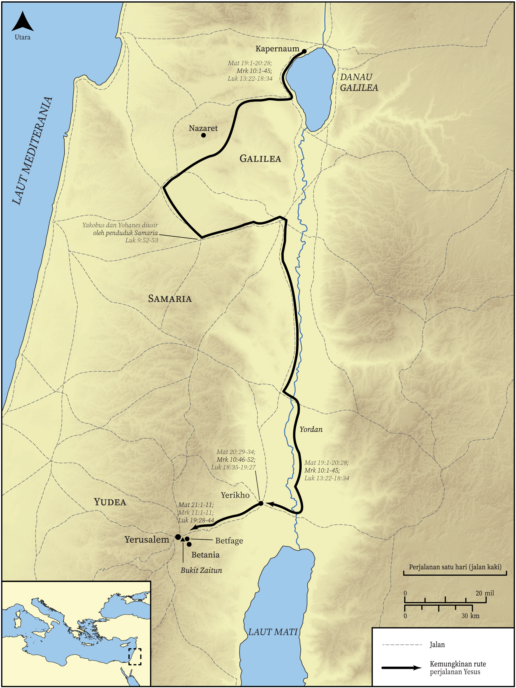

# Peta Alkitab Terbuka Biblica

## License Information

Biblica Open Bible Maps, © 2023–2025 Biblica, Inc. This work is licensed under Creative Commons Attribution-ShareAlike 4.0 International (https://creativecommons.org/licenses/by-sa/4.0/). More Information: https://docs.google.com/document/d/1Pp44yZ0Zdnd59vJHTrt2rPYq0SppfX5rZbPBt6mz37U/edit?tab=t.0#heading=h.oev9aj1ksvk2

--------------------------------

## Kehidupan Yesus: Perjalanan Terakhir Yesus ke Yerusalem dalam Injil Sinoptik (id: NT018)

### Image Content

[link](images/NT018.png)

* **Associated Passages:** Matius 19:1-21:46; Markus 10:1-11:33; Lukas 9:1-19:48

* **Associated ACAI Concepts:** Yesus (ID: `person:Jesus.2`); Tuhan (ID: `deity:Lord`); kerajaan (ID: `keyterm:Kingdom`); menjadi murid (ID: `keyterm:Disciple`); sorga (ID: `keyterm:Heaven`); Yerusalem (ID: `place:Jerusalem`); kehidupan (ID: `keyterm:Life`); keahlian (ID: `keyterm:Ability`); Pharisees (ID: `group:Pharisee`); memerintahkan (ID: `keyterm:Command`); berdoa (ID: `keyterm:Pray`); percaya (ID: `keyterm:Believe`); kekuasaan (ID: `keyterm:Authority.2`); takut (ID: `keyterm:Fear`); nama (ID: `keyterm:Name`); melayani (ID: `keyterm:Serve`); meminta (ID: `keyterm:AskFor`); kemuliaan (ID: `keyterm:Glory`); bertobat (ID: `keyterm:Repent`); selama, lamanya (ID: `keyterm:Always`); amin! (ID: `keyterm:Surely`); keselamatan (ID: `keyterm:Salvation`); Yohanes (ID: `person:John`); Demons (ID: `deity:Demons`); perumpamaan (ID: `keyterm:Parable`); belas kasihan (ID: `keyterm:Mercy`); tubuh (ID: `keyterm:Body.3`); Daud (ID: `person:David`); Petrus (ID: `person:Peter`); menjadi (atau menunjukkan diri) tidak bersalah (ID: `keyterm:Just`)
