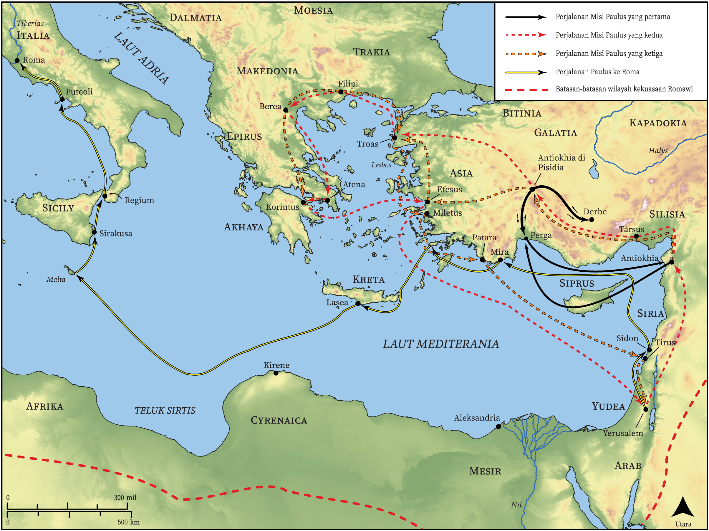

# Peta Alkitab Terbuka Biblica

## License Information

Biblica Open Bible Maps, © 2023–2025 Biblica, Inc. This work is licensed under Creative Commons Attribution-ShareAlike 4.0 International (<a href="https://creativecommons.org/licenses/by-sa/4.0/">https://creativecommons.org/licenses/by-sa/4.0/</a>). More Information: <a href="https://docs.google.com/document/d/1Pp44yZ0Zdnd59vJHTrt2rPYq0SppfX5rZbPBt6mz37U/edit?tab=t.0#heading=h.oev9aj1ksvk2">https://docs.google.com/document/d/1Pp44yZ0Zdnd59vJHTrt2rPYq0SppfX5rZbPBt6mz37U/edit?tab=t.0#heading=h.oev9aj1ksvk2</a>

--------------------------------

## Paulus dan Gereja Mula-mula: Gambaran Umum Perjalanan Paulus (id: NT024)

### Image Content

[link](images/NT024.png)

* **Associated Passages:** Kisah Para Rasul 13:1-28:31

* **Associated ACAI Concepts:** Paulus (ID: `person:Paul`); Tuhan (ID: `deity:Lord`); Jews (ID: `group:Jews`); Yesus (ID: `person:Jesus.2`); percaya (ID: `keyterm:Believe`); Yerusalem (ID: `place:Jerusalem`); nama (ID: `keyterm:Name`); Gentiles (ID: `group:Gentile`); meminta (ID: `keyterm:AskFor`); memutuskan (ID: `keyterm:Decided`); Barnabas (ID: `person:Barnabas`); Roma (ID: `place:Rome`); keselamatan (ID: `keyterm:Salvation`); kehidupan (ID: `keyterm:Life`); menjadi murid (ID: `keyterm:Disciple`); Roh (ID: `deity:HolySpirit`); hukum (ID: `keyterm:Law`); Festus (ID: `person:Festus`); membujuk (ID: `keyterm:Persuade`); Efesus (ID: `place:Ephesus`); Silas (ID: `person:Silas`); Asia (ID: `place:Asia`); Agripa (ID: `person:Agrippa`); Makedonia (ID: `place:Macedonia`); melayani (ID: `keyterm:Serve`); kebaikan (ID: `keyterm:Favor`); jemaat (ID: `keyterm:Church`); Greeks (ID: `group:Greek`); Klaudius (ID: `person:Claudius`); sembah (ID: `keyterm:Worship`)
