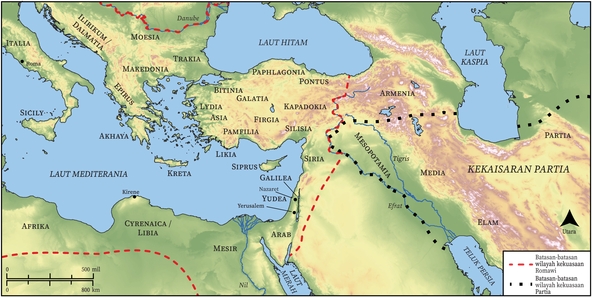

# Peta Alkitab Terbuka Biblica

## License Information

Biblica Open Bible Maps, © 2023–2025 Biblica, Inc. This work is licensed under Creative Commons Attribution-ShareAlike 4.0 International (<a href="https://creativecommons.org/licenses/by-sa/4.0/">https://creativecommons.org/licenses/by-sa/4.0/</a>). More Information: <a href="https://docs.google.com/document/d/1Pp44yZ0Zdnd59vJHTrt2rPYq0SppfX5rZbPBt6mz37U/edit?tab=t.0#heading=h.oev9aj1ksvk2">https://docs.google.com/document/d/1Pp44yZ0Zdnd59vJHTrt2rPYq0SppfX5rZbPBt6mz37U/edit?tab=t.0#heading=h.oev9aj1ksvk2</a>

--------------------------------

## Paulus dan Gereja Mula-mula: Perkumpulan pada Hari Pentakosta (id: NT031)

### Image Content

[link](images/NT031.png)

* **Associated Passages:** Kisah Para Rasul 2:1-47

* **Associated ACAI Concepts:** Tuhan (ID: `deity:Lord`); Yesus (ID: `person:Jesus.2`); Roh (ID: `deity:HolySpirit`); sorga (ID: `keyterm:Heaven`); mujizat (ID: `keyterm:Portent`); Petrus (ID: `person:Peter`); keselamatan (ID: `keyterm:Salvation`); hati (ID: `keyterm:Heart`); Daud (ID: `person:David`); tanda (ID: `keyterm:Example`); tubuh (ID: `keyterm:Body.3`); Yerusalem (ID: `place:Jerusalem`); baptisan (ID: `keyterm:Baptism`); alam maut (ID: `keyterm:WorldOfTheDead`); janji (ID: `keyterm:Promise`); Yehuda (ID: `place:Judea`); kepenuhan (roh) seperti nabi (ID: `keyterm:Speak`); Hell (ID: `place:Hell`); darah (ID: `keyterm:Blood`); nama (ID: `keyterm:Name`); Jews (ID: `group:Jews`); Israel (ID: `person:Israel`); Frigia (ID: `place:Phrygia`); berdoa (ID: `keyterm:CallUpon`); Yoël (ID: `person:Joel.14`); firman (ID: `keyterm:Word`); Cretans (ID: `group:Cretan`); Elamites (ID: `group:Elam`); Parthians (ID: `group:Parthians`); bertobat (ID: `keyterm:Repent`); Galileans (ID: `group:Galilee`); Media (ID: `person:Medan`); kebangkitan (ID: `keyterm:Resurrection`); Kirene (ID: `place:Cyrene`); persekutuan (ID: `keyterm:Fellowship`); Elam (ID: `place:Elam`); Libia (ID: `place:Libya`); Kapadokia (ID: `place:Cappadocia`); Pontus (ID: `place:Pontus`); Judeans (ID: `group:Judea`); Arabians (ID: `group:Arabia`); kebaikan (ID: `keyterm:Favor`); Kreta (ID: `place:Crete`); Aram-Mesopotamia (ID: `place:Mesopotamia`); Medes (ID: `group:Mede`); berdoa (ID: `keyterm:Pray`); Be Lawful (ID: `keyterm:Lawful`); Galilea (ID: `place:Galilee`); keahlian (ID: `keyterm:Ability`); Asia (ID: `place:Asia`); khusus (ID: `keyterm:Holy`); meminta (ID: `keyterm:AskFor`); Roma (ID: `place:Rome`); Israelites (ID: `group:Israel`); Nazaret (ID: `place:Nazareth`); harapan (ID: `keyterm:Hope`); berbuat dosa (ID: `keyterm:Sin`); kehidupan (ID: `keyterm:Life`); Pamfilia (ID: `place:Pamphylia`); Arab (ID: `place:Arabia`); (kepunyaan) bersama (ID: `keyterm:InCommon`); saksi (ID: `keyterm:Witness`); Mesir (ID: `place:Egypt`); tak kenal hukum (ID: `keyterm:Lawless`); takut (ID: `keyterm:Fear`); apa yang sebenarnya terjadi (ID: `keyterm:SomethingDefinite`); perbuatan besar (ID: `keyterm:MightyAct`); mengampuni (ID: `keyterm:Forgive`); sumpah (ID: `keyterm:Oath`); memberi kesaksian yang sungguh, sungguh (ID: `keyterm:Declare`); percaya (ID: `keyterm:Believe`); Cross (ID: `realia:Cross`); Temple (ID: `realia:Temple`); House (ID: `realia:House`); Sweet Wine (ID: `realia:SweetWine`); Grave (ID: `realia:Grave`); Throne (ID: `realia:Throne`); Footstool (ID: `realia:Footstool`)
