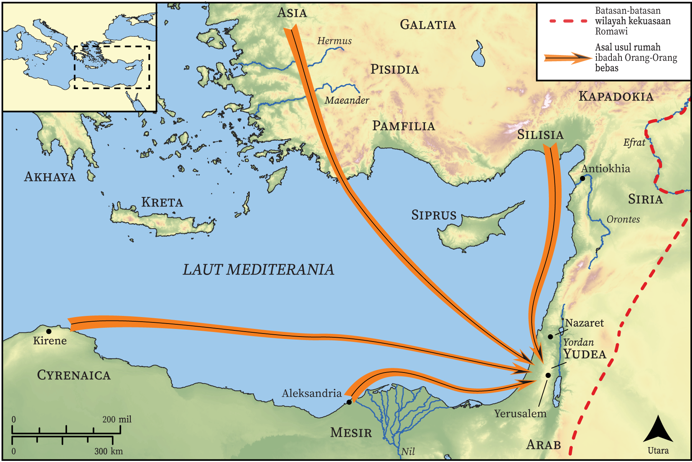

# Peta Alkitab Terbuka Biblica

## License Information

Biblica Open Bible Maps, © 2023–2025 Biblica, Inc. This work is licensed under Creative Commons Attribution-ShareAlike 4.0 International (https://creativecommons.org/licenses/by-sa/4.0/). More Information: https://docs.google.com/document/d/1Pp44yZ0Zdnd59vJHTrt2rPYq0SppfX5rZbPBt6mz37U/edit?tab=t.0#heading=h.oev9aj1ksvk2

--------------------------------

## Paulus dan Gereja Mula-mula: Lawan-lawan Stefanus (id: NT032)

### Image Content

[link](images/NT032.png)

* **Associated Passages:** Kisah Para Rasul 6:1-15

* **Associated ACAI Concepts:** Stefanus (ID: `person:Stephen`); melayani (ID: `keyterm:Serve`); Tuhan (ID: `deity:Lord`); Roh (ID: `deity:HolySpirit`); menjadi murid (ID: `keyterm:Disciple`); firman (ID: `keyterm:Word`); roh (ID: `keyterm:Spirit.2`); berdoa (ID: `keyterm:Pray`); percaya (ID: `keyterm:Believe`); Musa (ID: `person:Moses`); Filipus (ID: `person:Philip.4`); Alexandrians (ID: `group:Alexandria`); Parmenas (ID: `person:Parmenas`); Prokhorus (ID: `person:Prochorus`); Hellenists (ID: `group:Hellenist`); Nikanor (ID: `person:Nicanor`); Aleksandria (ID: `place:Alexandria`); Freedmen (ID: `group:Freedmen`); Timon (ID: `person:Timon`); Antiochians (ID: `group:Antioch`); Nikolaus (ID: `person:Nicolaus`); Asia (ID: `place:Asia`); saksi (ID: `keyterm:Witness`); khusus (ID: `keyterm:Holy`); An Angel (ID: `deity:Angel`); mujizat (ID: `keyterm:Portent`); Yesus (ID: `person:Jesus.2`); keahlian (ID: `keyterm:Ability`); tanda (ID: `keyterm:Example`); kebaikan (ID: `keyterm:Favor`); A Group of Disciples (ID: `group:GenericDisciples`); bersaksi (ID: `keyterm:BearWitness`); Yunani (ID: `place:Greece`); Hebrews (ID: `group:Hebrews`); hujat (ID: `keyterm:Blasphemous`); orang pilihan (ID: `keyterm:Chosen`); Kilikia (ID: `place:Cilicia`); Yerusalem (ID: `place:Jerusalem`); Antiokhia (ID: `place:Antioch`); Kirene (ID: `place:Cyrene`); Nazaret (ID: `place:Nazareth`); hukum (ID: `keyterm:Law`); Tabernacle (ID: `realia:Tabernacle`)
