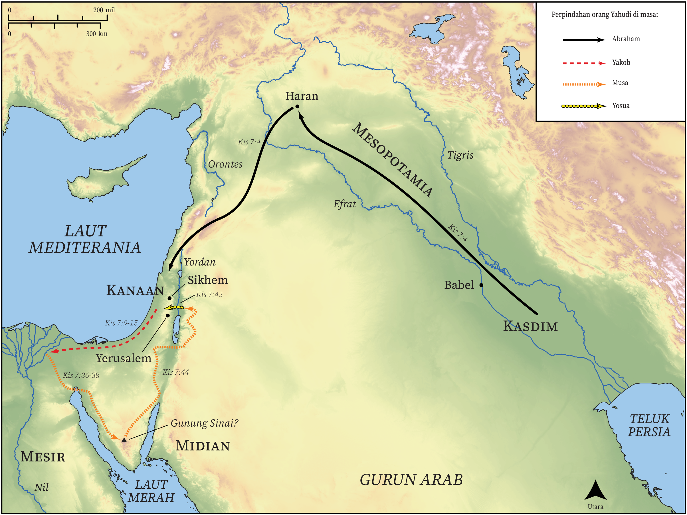

# Peta Alkitab Terbuka Biblica

## License Information

Biblica Open Bible Maps, © 2023–2025 Biblica, Inc. This work is licensed under Creative Commons Attribution-ShareAlike 4.0 International (https://creativecommons.org/licenses/by-sa/4.0/). More Information: https://docs.google.com/document/d/1Pp44yZ0Zdnd59vJHTrt2rPYq0SppfX5rZbPBt6mz37U/edit?tab=t.0#heading=h.oev9aj1ksvk2

--------------------------------

## Paulus dan Gereja Mula-mula: Stefanus Menceritakan Sejarah Bangsa Yahudi (id: NT033)

### Image Content

[link](images/NT033.png)

* **Associated Passages:** Kisah Para Rasul 7:1-60

* **Associated ACAI Concepts:** Tuhan (ID: `deity:Lord`); Mesir (ID: `place:Egypt`); Musa (ID: `person:Moses`); Israel (ID: `person:Israel`); Yusuf (ID: `person:Joseph.10`); sorga (ID: `keyterm:Heaven`); Abraham (ID: `person:Abraham`); An Angel (ID: `deity:Angel`); bertindak jahat (ID: `keyterm:ActWickedly`); Egyptians (ID: `group:Egypt`); hati (ID: `keyterm:Heart`); Yesus (ID: `person:Jesus.2`); melepaskan (ID: `keyterm:Rescue`); Firaun (ID: `person:Pharaoh.4`); Haran (ID: `place:Haran`); imamat (ID: `keyterm:Priesthood`); Roh (ID: `deity:HolySpirit`); hakim (ID: `keyterm:Judge`); melayani (ID: `keyterm:Serve`); kemuliaan (ID: `keyterm:Glory`); persembahan (ID: `keyterm:Offering`); Sinai (ID: `place:SinaiMount`); kebaikan (ID: `keyterm:Favor`); janji (ID: `keyterm:Promise`); Ishak (ID: `person:Isaac`); Aram-Mesopotamia (ID: `place:Mesopotamia`); Hemor (ID: `person:Hamor`); berdoa (ID: `keyterm:CallUpon`); Sekhem (ID: `place:Shechem`); Stefanus (ID: `person:Stephen`)
