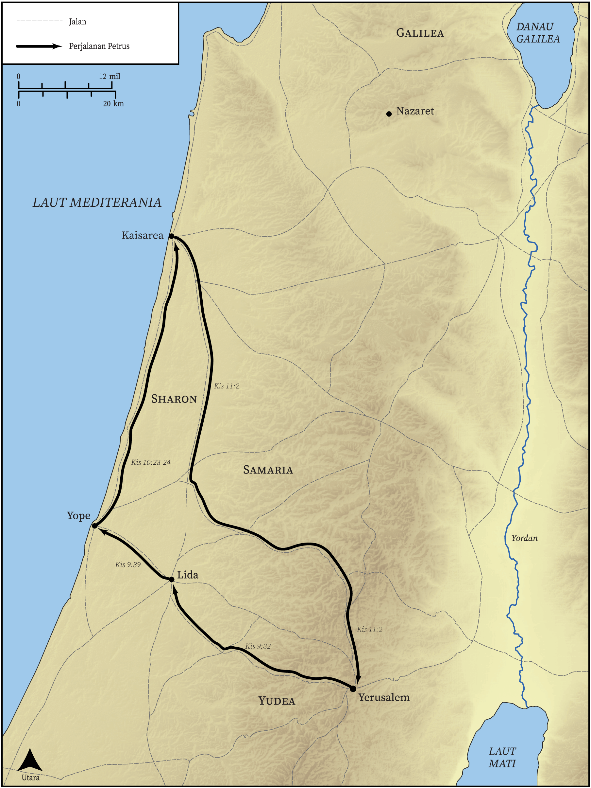

# Peta Alkitab Terbuka Biblica

## License Information

Biblica Open Bible Maps, © 2023–2025 Biblica, Inc. This work is licensed under Creative Commons Attribution-ShareAlike 4.0 International (https://creativecommons.org/licenses/by-sa/4.0/). More Information: https://docs.google.com/document/d/1Pp44yZ0Zdnd59vJHTrt2rPYq0SppfX5rZbPBt6mz37U/edit?tab=t.0#heading=h.oev9aj1ksvk2

--------------------------------

## Paulus dan Gereja Mula-mula: Perjalanan Petrus (id: NT036)

### Image Content

[link](images/NT036.png)

* **Associated Passages:** Kisah Para Rasul 9:1-11:30

* **Associated ACAI Concepts:** Petrus (ID: `person:Peter`); Tuhan (ID: `deity:Lord`); Yesus (ID: `person:Jesus.2`); nama (ID: `keyterm:Name`); Paulus (ID: `person:Paul`); Roh (ID: `deity:HolySpirit`); Kornelius (ID: `person:Cornelius`); Yafo (ID: `place:Joppa`); menjadi murid (ID: `keyterm:Disciple`); Yerusalem (ID: `place:Jerusalem`); Damsyik (ID: `place:Damascus`); sorga (ID: `keyterm:Heaven`); berdoa (ID: `keyterm:Pray`); Jews (ID: `group:Jews`); percaya (ID: `keyterm:Believe`); Antiokhia (ID: `place:Antioch`); meminta (ID: `keyterm:AskFor`); baptisan (ID: `keyterm:Baptism`); pencemaran (ID: `keyterm:Defilement`); takut (ID: `keyterm:Fear`); An Angel (ID: `deity:Angel`); firman (ID: `keyterm:Word`); House (ID: `realia:House`); Ananias (ID: `person:Ananias.2`); Simon (ID: `person:Simon.9`); Kaisarea (ID: `place:Caesarea`); Gentiles (ID: `group:Gentile`); Yehuda (ID: `place:Judea`); khusus (ID: `keyterm:Holy`); Temple (ID: `realia:Temple`)
