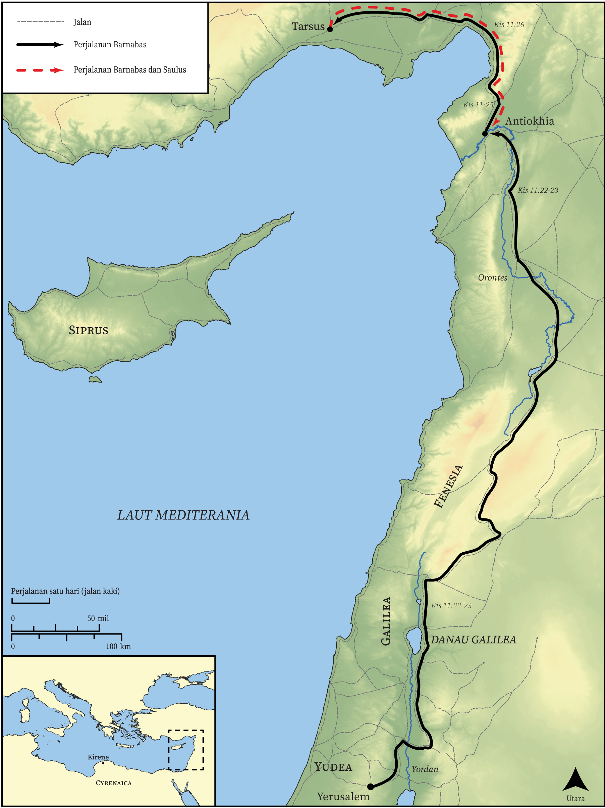

# Peta Alkitab Terbuka Biblica

## License Information

Biblica Open Bible Maps, © 2023–2025 Biblica, Inc. This work is licensed under Creative Commons Attribution-ShareAlike 4.0 International (<a href="https://creativecommons.org/licenses/by-sa/4.0/">https://creativecommons.org/licenses/by-sa/4.0/</a>). More Information: <a href="https://docs.google.com/document/d/1Pp44yZ0Zdnd59vJHTrt2rPYq0SppfX5rZbPBt6mz37U/edit?tab=t.0#heading=h.oev9aj1ksvk2">https://docs.google.com/document/d/1Pp44yZ0Zdnd59vJHTrt2rPYq0SppfX5rZbPBt6mz37U/edit?tab=t.0#heading=h.oev9aj1ksvk2</a>

--------------------------------

## Paulus dan Gereja Mula-mula: Jemaat di Antiokhia (id: NT037)

### Image Content

[link](images/NT037.png)

* **Associated Passages:** Kisah Para Rasul 11:1-30

* **Associated ACAI Concepts:** Tuhan (ID: `deity:Lord`); Antiokhia (ID: `place:Antioch`); Roh (ID: `deity:HolySpirit`); sorga (ID: `keyterm:Heaven`); Petrus (ID: `person:Peter`); Yesus (ID: `person:Jesus.2`); Yerusalem (ID: `place:Jerusalem`); percaya (ID: `keyterm:Believe`); menjadi murid (ID: `keyterm:Disciple`); Siprus (ID: `place:Cyprus`); House (ID: `realia:House`); bimbang (ID: `keyterm:Discern`); Gentiles (ID: `group:Gentile`); jemaat (ID: `keyterm:Church`); pencemaran (ID: `keyterm:Defilement`); Yafo (ID: `place:Joppa`); firman (ID: `keyterm:Word`); Barnabas (ID: `person:Barnabas`); Yehuda (ID: `place:Judea`); Paulus (ID: `person:Paul`); Klaudius (ID: `person:Claudius`); Agabus (ID: `person:Agabus`); Cypriots (ID: `group:Cyprus`); Christians (ID: `group:Christ`); Hellenists (ID: `group:Hellenist`); Fenisia (ID: `place:Phoenicia`); Temple (ID: `realia:Temple`); penyunatan (ID: `keyterm:Circumcision`); kebaikan (ID: `keyterm:Favor`); Tarsus (ID: `place:Tarsus`); melayani (ID: `keyterm:Serve`); keahlian (ID: `keyterm:Ability`); Jews (ID: `group:Jews`); An Angel (ID: `deity:Angel`); kemuliaan (ID: `keyterm:Glory`); nama (ID: `keyterm:Name`); meminta (ID: `keyterm:AskFor`); berdoa (ID: `keyterm:Pray`); Kirene (ID: `place:Cyrene`); keselamatan (ID: `keyterm:Salvation`); Kaisarea (ID: `place:Caesarea`); membersihkan (ID: `keyterm:Cleanse.2`); Yohanes (ID: `person:John`); kehidupan (ID: `keyterm:Life`); yang baik (ID: `keyterm:Good`); Stefanus (ID: `person:Stephen`); bertobat (ID: `keyterm:Repent`); hati (ID: `keyterm:Heart`); injil (ID: `keyterm:GoodNews`); Yunani (ID: `place:Greece`); baptisan (ID: `keyterm:Baptism`); Linen Cloth (ID: `realia:LinenCloth`); Monitor (ID: `fauna:Iguana`); Lizard (ID: `fauna:Lizard`); Chameleon (ID: `fauna:Chameleon`); Snake (ID: `fauna:Snake`); Creeping Animal (ID: `fauna:CreepingAnimal`)
