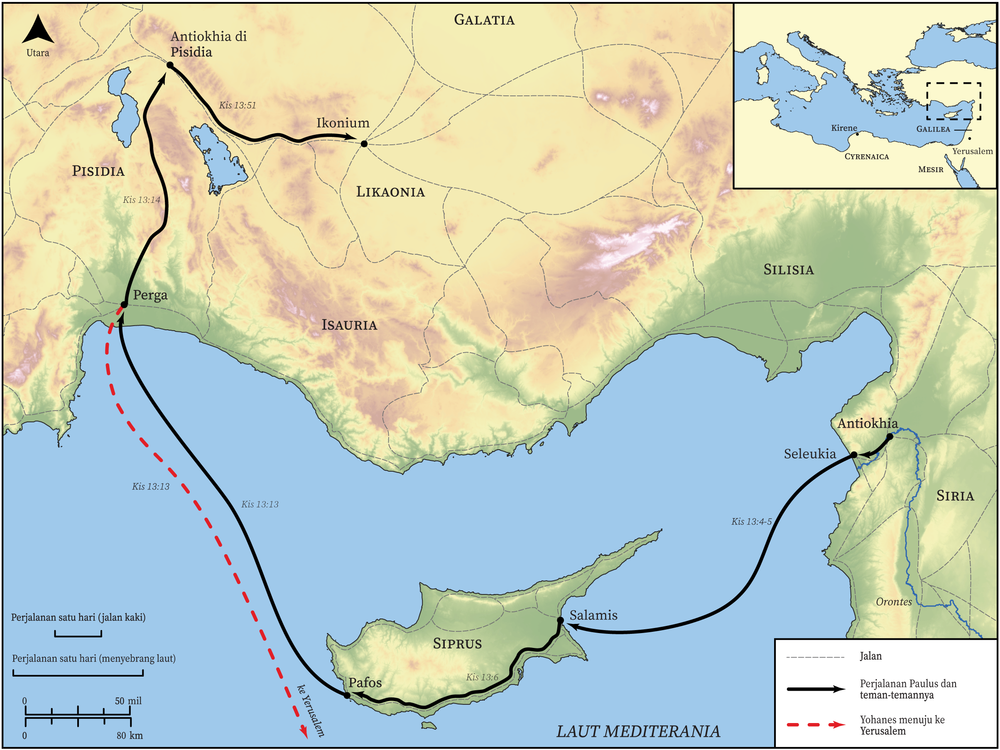

# Peta Alkitab Terbuka Biblica

## License Information

Biblica Open Bible Maps, © 2023–2025 Biblica, Inc. This work is licensed under Creative Commons Attribution-ShareAlike 4.0 International (<a href="https://creativecommons.org/licenses/by-sa/4.0/">https://creativecommons.org/licenses/by-sa/4.0/</a>). More Information: <a href="https://docs.google.com/document/d/1Pp44yZ0Zdnd59vJHTrt2rPYq0SppfX5rZbPBt6mz37U/edit?tab=t.0#heading=h.oev9aj1ksvk2">https://docs.google.com/document/d/1Pp44yZ0Zdnd59vJHTrt2rPYq0SppfX5rZbPBt6mz37U/edit?tab=t.0#heading=h.oev9aj1ksvk2</a>

--------------------------------

## Paulus dan Gereja Mula-mula: Perjalanan Misi Pertama Paulus (Bagian 1) (id: NT039)

### Image Content

[link](images/NT039.png)

* **Associated Passages:** Kisah Para Rasul 13:1-52

* **Associated ACAI Concepts:** Tuhan (ID: `deity:Lord`); Paulus (ID: `person:Paul`); Barnabas (ID: `person:Barnabas`); Jews (ID: `group:Jews`); percaya (ID: `keyterm:Believe`); sabat (ID: `keyterm:Sabbath`); Israel (ID: `person:Israel`); Roh (ID: `deity:HolySpirit`); Yerusalem (ID: `place:Jerusalem`); Gentiles (ID: `group:Gentile`); Daud (ID: `person:David`); Baryesus (ID: `person:Bar-jesus`); Pafos (ID: `place:Paphos`); Perga (ID: `place:Perga`); sembah (ID: `keyterm:Worship`); berpuasa (ID: `keyterm:Fast`); Synagogue (ID: `realia:Synagogue`); janji (ID: `keyterm:Promise`); keselamatan (ID: `keyterm:Salvation`); Yesus (ID: `person:Jesus.2`); khusus (ID: `keyterm:Holy`); meminta (ID: `keyterm:AskFor`); Yohanes (ID: `person:John`); kehidupan (ID: `keyterm:Life`); memutuskan (ID: `keyterm:Decided`); kebangkitan (ID: `keyterm:Resurrection`); takut (ID: `keyterm:Fear`); nama (ID: `keyterm:Name`); selama, lamanya (ID: `keyterm:Always`); Markus (ID: `person:Mark`)
