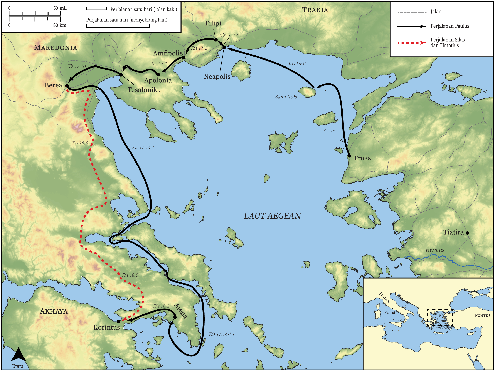

# Peta Alkitab Terbuka Biblica

## License Information

Biblica Open Bible Maps, © 2023–2025 Biblica, Inc. This work is licensed under Creative Commons Attribution-ShareAlike 4.0 International (https://creativecommons.org/licenses/by-sa/4.0/). More Information: https://docs.google.com/document/d/1Pp44yZ0Zdnd59vJHTrt2rPYq0SppfX5rZbPBt6mz37U/edit?tab=t.0#heading=h.oev9aj1ksvk2

--------------------------------

## Paulus dan Gereja Mula-mula: Perjalanan Misi Kedua Paulus (Bagian 3) (id: NT043)

### Image Content

[link](images/NT043.png)

* **Associated Passages:** Kisah Para Rasul 16:1-18:28

* **Associated ACAI Concepts:** Paulus (ID: `person:Paul`); Tuhan (ID: `deity:Lord`); Jews (ID: `group:Jews`); Yesus (ID: `person:Jesus.2`); Silas (ID: `person:Silas`); nama (ID: `keyterm:Name`); percaya (ID: `keyterm:Believe`); sembah (ID: `keyterm:Worship`); Greeks (ID: `group:Greek`); Atena (ID: `place:Athens`); Roma (ID: `place:Rome`); meminta (ID: `keyterm:AskFor`); Yunani (ID: `person:Javan`); Synagogue (ID: `realia:Synagogue`); Yason (ID: `person:Jason`); Makedonia (ID: `place:Macedonia`); Timotius (ID: `person:Timothy`); kitab suci (ID: `keyterm:Scripture`); baptisan (ID: `keyterm:Baptism`); Prison (ID: `realia:Prison`); Galio (ID: `person:Gallio`); Tesalonika (ID: `place:Thessalonica`); Akwila (ID: `person:Aquila`); Areopagus (ID: `place:Areopagus`); memutuskan (ID: `keyterm:Decided`); Priskila (ID: `person:Priscilla`); berdoa (ID: `keyterm:Pray`); keselamatan (ID: `keyterm:Salvation`); keahlian (ID: `keyterm:Ability`); sabat (ID: `keyterm:Sabbath`)
