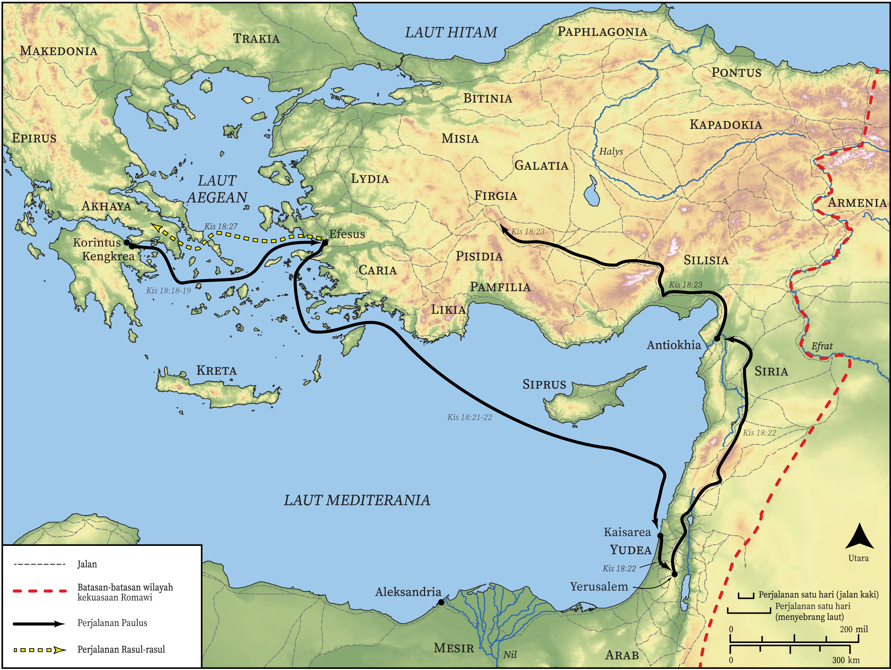

# Peta Alkitab Terbuka Biblica

## License Information

Biblica Open Bible Maps, © 2023–2025 Biblica, Inc. This work is licensed under Creative Commons Attribution-ShareAlike 4.0 International (https://creativecommons.org/licenses/by-sa/4.0/). More Information: https://docs.google.com/document/d/1Pp44yZ0Zdnd59vJHTrt2rPYq0SppfX5rZbPBt6mz37U/edit?tab=t.0#heading=h.oev9aj1ksvk2

--------------------------------

## Paulus dan Gereja Mula-mula: Akhir Perjalanan Misi Kedua Paulus dan Awal Perjalanan Ketiganya (id: NT044)

### Image Content

[link](images/NT044.png)

* **Associated Passages:** Kisah Para Rasul 18:1-28

* **Associated ACAI Concepts:** Jews (ID: `group:Jews`); Tuhan (ID: `deity:Lord`); Paulus (ID: `person:Paul`); Synagogue (ID: `realia:Synagogue`); nama (ID: `keyterm:Name`); Galio (ID: `person:Gallio`); Akwila (ID: `person:Aquila`); Priskila (ID: `person:Priscilla`); Efesus (ID: `place:Ephesus`); Yesus (ID: `person:Jesus.2`); Judgment Seat (ID: `realia:JudgmentSeat`); sembah (ID: `keyterm:Worship`); Korintus (ID: `place:Corinth`); Akhaya (ID: `place:Achaia`); percaya (ID: `keyterm:Believe`); hukum (ID: `keyterm:Law`); baptisan (ID: `keyterm:Baptism`); jalan tuhan (ID: `keyterm:TheWay`); kitab suci (ID: `keyterm:Scripture`); menjadi murid (ID: `keyterm:Disciple`); Klaudius (ID: `person:Claudius`); Corinthians (ID: `group:Corinth`); Alexandrians (ID: `group:Alexandria`); Pontus (ID: `place:Pontus`); Galatia (ID: `place:Galatia`); Apolos (ID: `person:Apollos`); Frigia (ID: `place:Phrygia`); Roma (ID: `place:Rome`); Yustus (ID: `person:Justus.2`); Aleksandria (ID: `place:Alexandria`); Kengkrea (ID: `place:Cenchreae`); Sostenes (ID: `person:Sosthenes`); Krispus (ID: `person:Crispus`); Pontus (ID: `group:Pontus`); Yunani (ID: `person:Javan`); memberi kesaksian yang sungguh, sungguh (ID: `keyterm:Declare`); membujuk (ID: `keyterm:Persuade`); meminta (ID: `keyterm:AskFor`); jemaat (ID: `keyterm:Church`); kebaikan (ID: `keyterm:Favor`); Makedonia (ID: `place:Macedonia`); Yohanes (ID: `person:John`); Silas (ID: `person:Silas`); Antiokhia (ID: `place:Antioch`); Atena (ID: `place:Athens`); takut (ID: `keyterm:Fear`); Kaisarea (ID: `place:Caesarea`); suci (ID: `keyterm:Clean`); Italia (ID: `place:Italy`); Greeks (ID: `group:Greek`); menghujat (ID: `keyterm:Blaspheme`); kejahatan (ID: `keyterm:UnrighteousAct`); sabat (ID: `keyterm:Sabbath`); Gentiles (ID: `group:Gentile`); darah (ID: `keyterm:Blood`); Timotius (ID: `person:Timothy`); bernazar (ID: `keyterm:Vow`); roh (ID: `keyterm:Spirit.2`); Clothing (ID: `realia:Clothing`); Tent (ID: `realia:Tent`); House (ID: `realia:House`)
