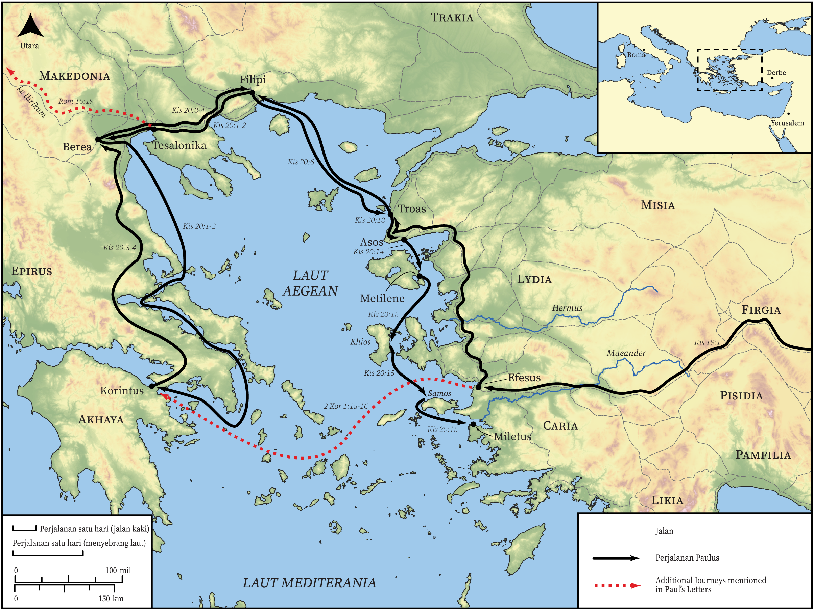

# Peta Alkitab Terbuka Biblica

## License Information

Biblica Open Bible Maps, © 2023–2025 Biblica, Inc. This work is licensed under Creative Commons Attribution-ShareAlike 4.0 International (https://creativecommons.org/licenses/by-sa/4.0/). More Information: https://docs.google.com/document/d/1Pp44yZ0Zdnd59vJHTrt2rPYq0SppfX5rZbPBt6mz37U/edit?tab=t.0#heading=h.oev9aj1ksvk2

--------------------------------

## Paulus dan Gereja Mula-mula: Perjalanan Misi Ketiga Paulus (Bagian 1) (id: NT045)

### Image Content

[link](images/NT045.png)

* **Associated Passages:** Kisah Para Rasul 19:1-20:38

* **Associated ACAI Concepts:** Paulus (ID: `person:Paul`); Tuhan (ID: `deity:Lord`); Jews (ID: `group:Jews`); Efesus (ID: `place:Ephesus`); Yesus (ID: `person:Jesus.2`); Asia (ID: `place:Asia`); Makedonia (ID: `place:Macedonia`); Artemis (ID: `deity:Artemis`); Roh (ID: `deity:HolySpirit`); nama (ID: `keyterm:Name`); menjadi murid (ID: `keyterm:Disciple`); memberi kesaksian yang sungguh, sungguh (ID: `keyterm:Declare`); meminta (ID: `keyterm:AskFor`); percaya (ID: `keyterm:Believe`); Ephesians (ID: `group:Ephesus`); Yunani (ID: `person:Javan`); baptisan (ID: `keyterm:Baptism`); kehidupan (ID: `keyterm:Life`); melayani (ID: `keyterm:Serve`); Yerusalem (ID: `place:Jerusalem`); menasihati (ID: `keyterm:Encourage`); Greeks (ID: `group:Greek`); Miletus (ID: `place:Miletus`); Demetrius (ID: `person:Demetrius`); Aristarkhus (ID: `person:Aristarchus`); Troas (ID: `place:Troas`); Asos (ID: `place:Assos`); memberitakan (ID: `keyterm:Proclaim`); jalan tuhan (ID: `keyterm:TheWay`); jemaat (ID: `keyterm:Church`)
