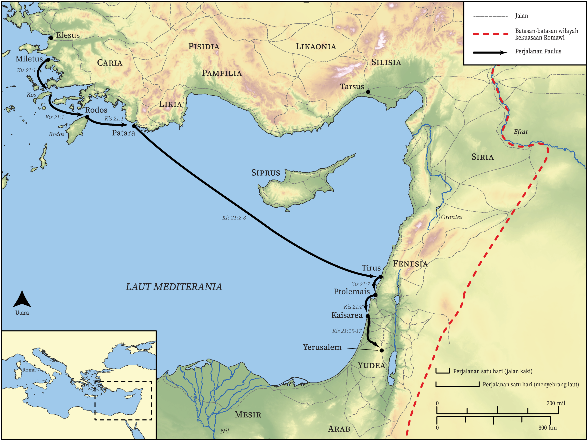

# Peta Alkitab Terbuka Biblica

## License Information

Biblica Open Bible Maps, © 2023–2025 Biblica, Inc. This work is licensed under Creative Commons Attribution-ShareAlike 4.0 International (https://creativecommons.org/licenses/by-sa/4.0/). More Information: https://docs.google.com/document/d/1Pp44yZ0Zdnd59vJHTrt2rPYq0SppfX5rZbPBt6mz37U/edit?tab=t.0#heading=h.oev9aj1ksvk2

--------------------------------

## Paulus dan Gereja Mula-mula: Perjalanan Misi Ketiga Paulus (Bagian 2) (id: NT046)

### Image Content

[link](images/NT046.png)

* **Associated Passages:** Kisah Para Rasul 21:1-40

* **Associated ACAI Concepts:** Paulus (ID: `person:Paul`); Yerusalem (ID: `place:Jerusalem`); Jews (ID: `group:Jews`); Temple (ID: `realia:Temple`); Gentiles (ID: `group:Gentile`); Tuhan (ID: `deity:Lord`); hukum (ID: `keyterm:Law`); Kaisarea (ID: `place:Caesarea`); Ship (ID: `realia:Ship`); percaya (ID: `keyterm:Believe`); murni (ID: `keyterm:Pure`); Siprus (ID: `place:Cyprus`); Roh (ID: `deity:HolySpirit`); nama (ID: `keyterm:Name`); menjadi murid (ID: `keyterm:Disciple`); Tirus (ID: `place:Tyre`); Step (ID: `realia:Step`); Manason (ID: `person:Mnason`); Patara (ID: `place:Patara`); Tarsus (ID: `place:Tarsus`); Kilikia (ID: `place:Cilicia`); Trofimus (ID: `person:Trophimus`); Rodos (ID: `place:Rhodes`); Filipus (ID: `person:Philip.4`); Agabus (ID: `person:Agabus`); Fenisia (ID: `place:Phoenicia`); Tarsus (ID: `group:Tarsus`); Cypriots (ID: `group:Cyprus`); Kos (ID: `place:Cos`); persundalan (ID: `keyterm:Fornication`); Yunani (ID: `person:Javan`); Israelites (ID: `group:Israel`); Ephesians (ID: `group:Ephesus`); Egyptians (ID: `group:Egypt`); membujuk (ID: `keyterm:Persuade`); meminta (ID: `keyterm:AskFor`); Musa (ID: `person:Moses`); Ako (ID: `place:Acco`); kemuliaan (ID: `keyterm:Glory`); Yakobus (ID: `person:James.3`); bernazar (ID: `keyterm:Vow`); pencemaran (ID: `keyterm:Defilement`); apa yang sebenarnya terjadi (ID: `keyterm:SomethingDefinite`); Asia (ID: `place:Asia`); kepenuhan (roh) seperti nabi (ID: `keyterm:Speak`); Efesus (ID: `place:Ephesus`); persembahan (ID: `keyterm:Offering`); Be Lawful (ID: `keyterm:Lawful`); memutuskan (ID: `keyterm:Decided`); berdoa (ID: `keyterm:Pray`); Mesir (ID: `place:Egypt`); Yehuda (ID: `place:Judea`); hati (ID: `keyterm:Heart`); hidup (ID: `keyterm:Live.3`); Greeks (ID: `group:Greek`); Military Member (ID: `person:MilitaryMember`); melayani (ID: `keyterm:Serve`); Israel (ID: `person:Israel`); khusus (ID: `keyterm:Holy`); darah (ID: `keyterm:Blood`); Yesus (ID: `person:Jesus.2`); Belt (ID: `realia:Belt`); Bag (ID: `realia:Bag`); House (ID: `realia:House`); Tabernacle (ID: `realia:Tabernacle`); Door (ID: `realia:Door`); Chain (ID: `realia:Chain`)
