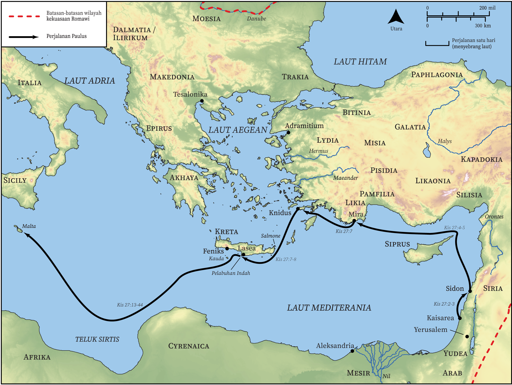

# Peta Alkitab Terbuka Biblica

## License Information

Biblica Open Bible Maps, © 2023–2025 Biblica, Inc. This work is licensed under Creative Commons Attribution-ShareAlike 4.0 International (https://creativecommons.org/licenses/by-sa/4.0/). More Information: https://docs.google.com/document/d/1Pp44yZ0Zdnd59vJHTrt2rPYq0SppfX5rZbPBt6mz37U/edit?tab=t.0#heading=h.oev9aj1ksvk2

--------------------------------

## Paulus dan Gereja Mula-mula: Perjalanan Paulus ke Roma (Bagian 1) (id: NT048)

### Image Content

[link](images/NT048.png)

* **Associated Passages:** Kisah Para Rasul 27:1-44

* **Associated ACAI Concepts:** Ship (ID: `realia:Ship`); Paulus (ID: `person:Paul`); keselamatan (ID: `keyterm:Salvation`); Kreta (ID: `place:Crete`); Tuhan (ID: `deity:Lord`); takut (ID: `keyterm:Fear`); Anchor (ID: `realia:Anchor`); Yulius (ID: `person:Julius`); Italia (ID: `place:Italy`); meminta (ID: `keyterm:AskFor`); kehidupan (ID: `keyterm:Life`); Indah (ID: `place:FairHavens`); Asia (ID: `place:Asia`); Aristarkhus (ID: `person:Aristarchus`); Adramitium (ID: `place:Adramyttium`); Agustus (ID: `person:Augustus`); Salmone (ID: `place:Salmone`); Lasea (ID: `place:Lasea`); Mira (ID: `place:Myra`); Knidus (ID: `place:Cnidus`); Sidon (ID: `place:Sidon`); Aleksandria (ID: `place:Alexandria`); Adria (ID: `place:AdriaticSea`); Sirtis (ID: `place:Syrtis`); Pamfilia (ID: `place:Pamphylia`); Kilikia (ID: `place:Cilicia`); Likia (ID: `place:Lycia`); Feniks (ID: `place:Phoenix`); Kauda (ID: `place:Cauda`); Rope (ID: `realia:Rope`); berpuasa (ID: `keyterm:Fast`); mengampuni (ID: `keyterm:Forgive`); An Angel (ID: `deity:Angel`); Makedonia (ID: `place:Macedonia`); harapan (ID: `keyterm:Hope`); imamat (ID: `keyterm:Priesthood`); melayani (ID: `keyterm:Serve`); memutuskan (ID: `keyterm:Decided`); berdoa (ID: `keyterm:Pray`); Klaudius (ID: `person:Claudius`); Thessalonians (ID: `group:Thessalonica`); percaya (ID: `keyterm:Believe`); Tesalonika (ID: `place:Thessalonica`); Siprus (ID: `place:Cyprus`); nama (ID: `keyterm:Name`); membujuk (ID: `keyterm:Persuade`); Fathom (ID: `realia:Fathom`); Sail (ID: `realia:Sail`); Rudder (ID: `realia:Rudder`); Wheat (ID: `flora:Wheat`)
