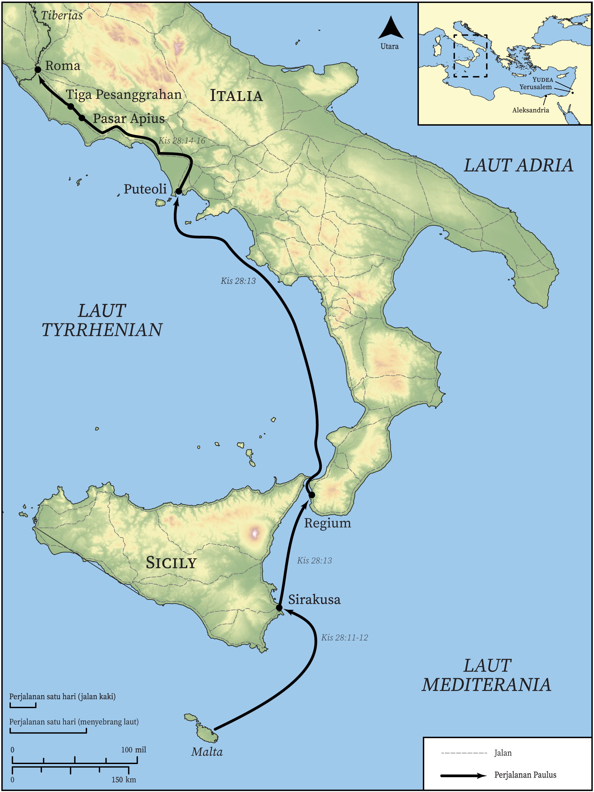

# Peta Alkitab Terbuka Biblica

## License Information

Biblica Open Bible Maps, © 2023–2025 Biblica, Inc. This work is licensed under Creative Commons Attribution-ShareAlike 4.0 International (https://creativecommons.org/licenses/by-sa/4.0/). More Information: https://docs.google.com/document/d/1Pp44yZ0Zdnd59vJHTrt2rPYq0SppfX5rZbPBt6mz37U/edit?tab=t.0#heading=h.oev9aj1ksvk2

--------------------------------

## Paulus dan Gereja Mula-mula: Perjalanan Paulus ke Roma (Bagian 2) (id: NT049)

### Image Content

[link](images/NT049.png)

* **Associated Passages:** Kisah Para Rasul 28:1-31

* **Associated ACAI Concepts:** Paulus (ID: `person:Paul`); Tuhan (ID: `deity:Lord`); Roma (ID: `place:Rome`); keselamatan (ID: `keyterm:Salvation`); Publius (ID: `person:Publius`); membujuk (ID: `keyterm:Persuade`); meminta (ID: `keyterm:AskFor`); kerajaan (ID: `keyterm:Kingdom`); Jews (ID: `group:Jews`); Yesus (ID: `person:Jesus.2`); Regium (ID: `place:Rhegium`); Forum (ID: `place:ForumOfAppius`); Tres (ID: `place:ThreeTaverns`); Putioli (ID: `place:Puteoli`); Aleksandria (ID: `place:Alexandria`); Sirakusa (ID: `place:Syracuse`); Malta (ID: `place:Malta`); memberi kesaksian yang sungguh, sungguh (ID: `keyterm:Declare`); tidak percaya (ID: `keyterm:Disbelieve`); Musa (ID: `person:Moses`); hukum (ID: `keyterm:Law`); Yerusalem (ID: `place:Jerusalem`); Klaudius (ID: `person:Claudius`); Yesaya (ID: `person:Isaiah`); berdoa (ID: `keyterm:CallUpon`); memberitakan (ID: `keyterm:Proclaim`); Roh (ID: `deity:HolySpirit`); firman (ID: `keyterm:Word`); harapan (ID: `keyterm:Hope`); kehidupan (ID: `keyterm:Life`); nama (ID: `keyterm:Name`); menjadi (atau menunjukkan diri) tidak bersalah (ID: `keyterm:Just`); berdoa (ID: `keyterm:Pray`); Yehuda (ID: `place:Judea`); memikirkan (ID: `keyterm:Think`); hati (ID: `keyterm:Heart`); melayani (ID: `keyterm:Serve`); Israel (ID: `person:Israel`); kebaikan (ID: `keyterm:Kindness`); secara menjamu (ID: `keyterm:Hospitably`); Gentiles (ID: `group:Gentile`); bimbang (ID: `keyterm:Discern`); Emblem (ID: `realia:Emblem`); Chain (ID: `realia:Chain`); Snake (ID: `fauna:Snake`); Guest Room (ID: `realia:GuestRoom`); Ship (ID: `realia:Ship`); Cobra (ID: `fauna:Cobra`); Inn (ID: `realia:Inn`)
