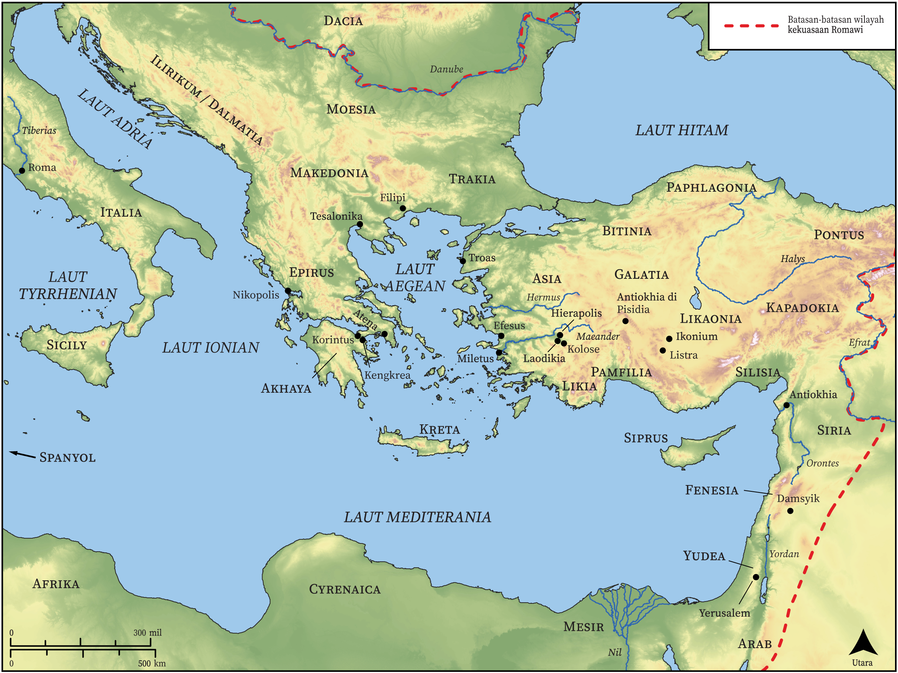

# Peta Alkitab Terbuka Biblica

## License Information

Biblica Open Bible Maps, © 2023–2025 Biblica, Inc. This work is licensed under Creative Commons Attribution-ShareAlike 4.0 International (<a href="https://creativecommons.org/licenses/by-sa/4.0/">https://creativecommons.org/licenses/by-sa/4.0/</a>). More Information: <a href="https://docs.google.com/document/d/1Pp44yZ0Zdnd59vJHTrt2rPYq0SppfX5rZbPBt6mz37U/edit?tab=t.0#heading=h.oev9aj1ksvk2">https://docs.google.com/document/d/1Pp44yZ0Zdnd59vJHTrt2rPYq0SppfX5rZbPBt6mz37U/edit?tab=t.0#heading=h.oev9aj1ksvk2</a>

--------------------------------

## Paulus dan Gereja Mula-mula: Ikhtisar Surat-surat (id: NT050)

### Image Content

[link](images/NT050.png)

* **Associated Passages:** Roma 1:1-16:27; 1 Korintus 1:1-16:24; 2 Korintus 1:1-13:13; Galatia 1:1-6:18; Filipi 1:1-4:23; Kolose 1:1-4:18; 1 Tesalonika 1:1-5:28; 2 Tesalonika 1:1-3:18; 1 Timotius 1:1-6:21; 2 Timotius 1:1-4:22; Titus 1:1-3:15; 1 Petrus 1:1-5:14; 2 Petrus 1:1-3:18; Wahyu 1:1-22:21

* **Associated ACAI Concepts:** Tuhan (ID: `deity:Lord`); Yesus (ID: `person:Jesus.2`); percaya (ID: `keyterm:Believe`); keahlian (ID: `keyterm:Ability`); tubuh (ID: `keyterm:Body.3`); kehidupan (ID: `keyterm:Life`); kebaikan (ID: `keyterm:Favor`); kemuliaan (ID: `keyterm:Glory`); menjadi (atau menunjukkan diri) tidak bersalah (ID: `keyterm:Just`); Roh (ID: `deity:HolySpirit`); kasihi (ID: `keyterm:Love`); hukum (ID: `keyterm:Law`); An Angel (ID: `deity:Angel`); khusus (ID: `keyterm:Holy`); berbuat dosa (ID: `keyterm:Sin`); sorga (ID: `keyterm:Heaven`); hati (ID: `keyterm:Heart`); jemaat (ID: `keyterm:Church`); injil (ID: `keyterm:GoodNews`); meminta (ID: `keyterm:AskFor`); dalam kristus (ID: `keyterm:InChrist`); selama, lamanya (ID: `keyterm:Always`); keselamatan (ID: `keyterm:Salvation`); roh (ID: `keyterm:Spirit.2`); yang baik (ID: `keyterm:Good`); harapan (ID: `keyterm:Hope`); nama (ID: `keyterm:Name`); memutuskan (ID: `keyterm:Decided`); kekuasaan (ID: `keyterm:Authority.2`); kebangkitan (ID: `keyterm:Resurrection`)
