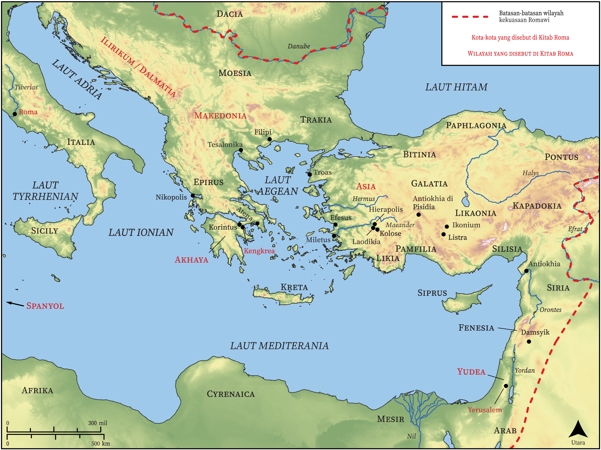

# Peta Alkitab Terbuka Biblica

## License Information

Biblica Open Bible Maps, © 2023–2025 Biblica, Inc. This work is licensed under Creative Commons Attribution-ShareAlike 4.0 International (https://creativecommons.org/licenses/by-sa/4.0/). More Information: https://docs.google.com/document/d/1Pp44yZ0Zdnd59vJHTrt2rPYq0SppfX5rZbPBt6mz37U/edit?tab=t.0#heading=h.oev9aj1ksvk2

--------------------------------

## Paulus dan Gereja Mula-mula: Roma (id: NT051)

### Image Content

[link](images/NT051.png)

* **Associated Passages:** Roma 1:1-16:27

* **Associated ACAI Concepts:** Tuhan (ID: `deity:Lord`); Yesus (ID: `person:Jesus.2`); hukum (ID: `keyterm:Law`); percaya (ID: `keyterm:Believe`); berbuat dosa (ID: `keyterm:Sin`); menjadi (atau menunjukkan diri) tidak bersalah (ID: `keyterm:Just`); tubuh (ID: `keyterm:Body.3`); kehidupan (ID: `keyterm:Life`); kebaikan (ID: `keyterm:Favor`); keahlian (ID: `keyterm:Ability`); Roh (ID: `deity:HolySpirit`); yang baik (ID: `keyterm:Good`); hati (ID: `keyterm:Heart`); kemuliaan (ID: `keyterm:Glory`); Gentiles (ID: `group:Gentile`); memutuskan (ID: `keyterm:Decided`); kasihi (ID: `keyterm:Love`); khusus (ID: `keyterm:Holy`); dalam kristus (ID: `keyterm:InChrist`); keselamatan (ID: `keyterm:Salvation`); harapan (ID: `keyterm:Hope`); Israel (ID: `person:Israel`); penyunatan (ID: `keyterm:Circumcision`); injil (ID: `keyterm:GoodNews`); Jews (ID: `group:Jews`); janji (ID: `keyterm:Promise`); belas kasihan (ID: `keyterm:Mercy`); kebangkitan (ID: `keyterm:Resurrection`); memperdamaikan (ID: `keyterm:Peace`); Abraham (ID: `person:Abraham`)
