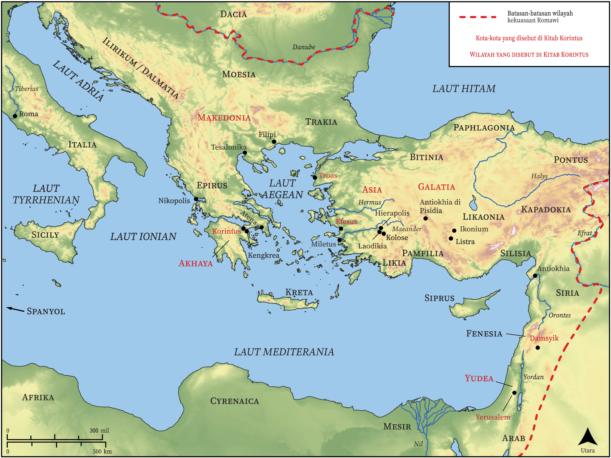

# Peta Alkitab Terbuka Biblica

## License Information

Biblica Open Bible Maps, © 2023–2025 Biblica, Inc. This work is licensed under Creative Commons Attribution-ShareAlike 4.0 International (https://creativecommons.org/licenses/by-sa/4.0/). More Information: https://docs.google.com/document/d/1Pp44yZ0Zdnd59vJHTrt2rPYq0SppfX5rZbPBt6mz37U/edit?tab=t.0#heading=h.oev9aj1ksvk2

--------------------------------

## Paulus dan Gereja Mula-mula: Korintus (id: NT052)

### Image Content

[link](images/NT052.png)

* **Associated Passages:** 1 Korintus 1:1-16:24; 2 Korintus 1:1-13:13

* **Associated ACAI Concepts:** Tuhan (ID: `deity:Lord`); Yesus (ID: `person:Jesus.2`); keahlian (ID: `keyterm:Ability`); tubuh (ID: `keyterm:Body.3`); kebaikan (ID: `keyterm:Favor`); jemaat (ID: `keyterm:Church`); Roh (ID: `deity:HolySpirit`); meminta (ID: `keyterm:AskFor`); kasihi (ID: `keyterm:Love`); kemuliaan (ID: `keyterm:Glory`); roh (ID: `keyterm:Spirit.2`); percaya (ID: `keyterm:Believe`); kebangkitan (ID: `keyterm:Resurrection`); injil (ID: `keyterm:GoodNews`); hati (ID: `keyterm:Heart`); memutuskan (ID: `keyterm:Decided`); dalam kristus (ID: `keyterm:InChrist`); kehidupan (ID: `keyterm:Life`); melayani (ID: `keyterm:Serve`); khusus (ID: `keyterm:Holy`); bimbang (ID: `keyterm:Discern`); harapan (ID: `keyterm:Hope`); kekuasaan (ID: `keyterm:Authority.2`); selama, lamanya (ID: `keyterm:Always`); keselamatan (ID: `keyterm:Salvation`); berbuat dosa (ID: `keyterm:Sin`); berdoa (ID: `keyterm:Pray`); memberitakan (ID: `keyterm:Proclaim`); kepenuhan (roh) seperti nabi (ID: `keyterm:Speak`); hati nurani (ID: `keyterm:Conscience`)
