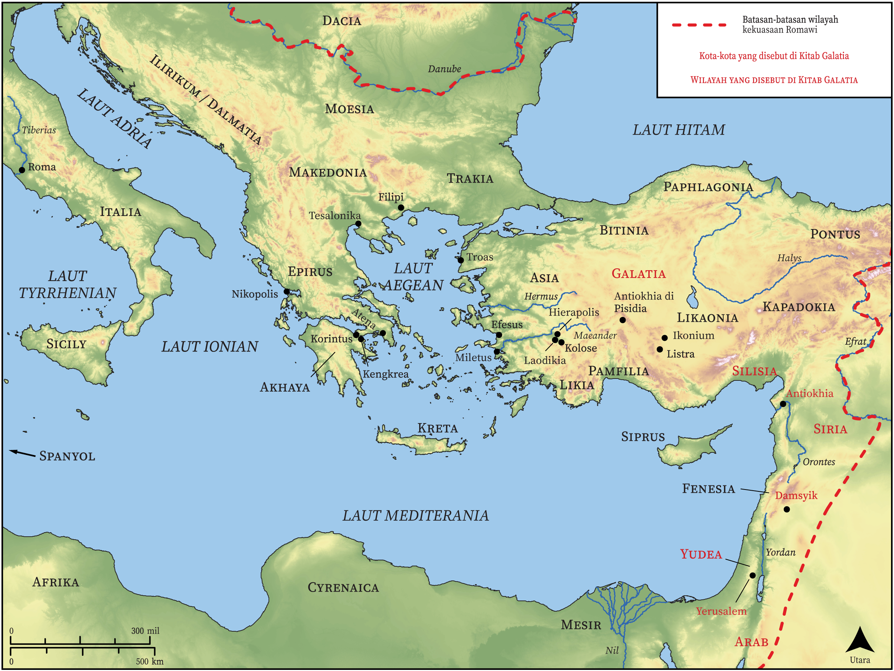

# Peta Alkitab Terbuka Biblica

## License Information

Biblica Open Bible Maps, © 2023–2025 Biblica, Inc. This work is licensed under Creative Commons Attribution-ShareAlike 4.0 International (https://creativecommons.org/licenses/by-sa/4.0/). More Information: https://docs.google.com/document/d/1Pp44yZ0Zdnd59vJHTrt2rPYq0SppfX5rZbPBt6mz37U/edit?tab=t.0#heading=h.oev9aj1ksvk2

--------------------------------

## Paulus dan Gereja Mula-mula: Galatia (id: NT053)

### Image Content

[link](images/NT053.png)

* **Associated Passages:** Galatia 1:1-6:18

* **Associated ACAI Concepts:** Yesus (ID: `person:Jesus.2`); Tuhan (ID: `deity:Lord`); hukum (ID: `keyterm:Law`); percaya (ID: `keyterm:Believe`); tubuh (ID: `keyterm:Body.3`); Roh (ID: `deity:HolySpirit`); injil (ID: `keyterm:GoodNews`); menjadi (atau menunjukkan diri) tidak bersalah (ID: `keyterm:Just`); janji (ID: `keyterm:Promise`); Abraham (ID: `person:Abraham`); Gentiles (ID: `group:Gentile`); penyunatan (ID: `keyterm:Circumcision`); kehidupan (ID: `keyterm:Life`); kebaikan (ID: `keyterm:Favor`); dalam kristus (ID: `keyterm:InChrist`); Petrus (ID: `person:Peter`); kasihi (ID: `keyterm:Love`); Yerusalem (ID: `place:Jerusalem`); keahlian (ID: `keyterm:Ability`); melayani (ID: `keyterm:Serve.2`); Jews (ID: `group:Jews`); Cross (ID: `realia:Cross`); Barnabas (ID: `person:Barnabas`); yang baik (ID: `keyterm:Good`); membujuk (ID: `keyterm:Persuade`); Yakobus (ID: `person:James.3`); berbuat dosa (ID: `keyterm:Sin`); kitab suci (ID: `keyterm:Scripture`); kebenaran (ID: `keyterm:Truth`); jemaat (ID: `keyterm:Church`)
