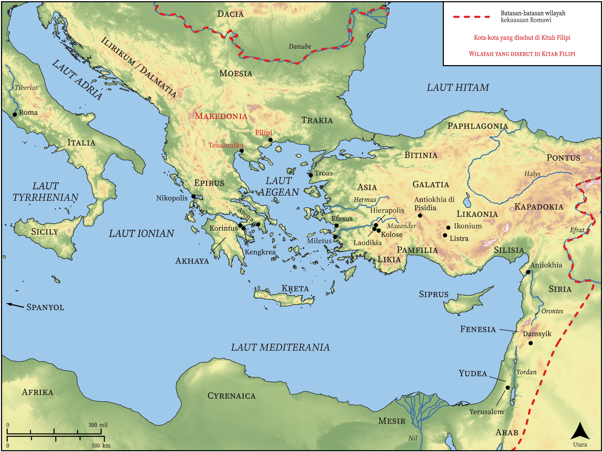

# Peta Alkitab Terbuka Biblica

## License Information

Biblica Open Bible Maps, © 2023–2025 Biblica, Inc. This work is licensed under Creative Commons Attribution-ShareAlike 4.0 International (https://creativecommons.org/licenses/by-sa/4.0/). More Information: https://docs.google.com/document/d/1Pp44yZ0Zdnd59vJHTrt2rPYq0SppfX5rZbPBt6mz37U/edit?tab=t.0#heading=h.oev9aj1ksvk2

--------------------------------

## Paulus dan Gereja Mula-mula: Filipi (id: NT054)

### Image Content

[link](images/NT054.png)

* **Associated Passages:** Filipi 1:1-4:23

* **Associated ACAI Concepts:** Yesus (ID: `person:Jesus.2`); Tuhan (ID: `deity:Lord`); dalam kristus (ID: `keyterm:InChrist`); injil (ID: `keyterm:GoodNews`); hati (ID: `keyterm:Heart`); memikirkan (ID: `keyterm:Think`); kehidupan (ID: `keyterm:Life`); tubuh (ID: `keyterm:Body.3`); membujuk (ID: `keyterm:Persuade`); kemuliaan (ID: `keyterm:Glory`); Cause of Joy (ID: `keyterm:CauseOfJoy`); percaya (ID: `keyterm:Believe`); menjadi (atau menunjukkan diri) tidak bersalah (ID: `keyterm:Just`); kasihi (ID: `keyterm:Love`); berdoa (ID: `keyterm:Pray`); hukum (ID: `keyterm:Law`); meminta (ID: `keyterm:AskFor`); keselamatan (ID: `keyterm:Salvation`); imamat (ID: `keyterm:Priesthood`); Roh (ID: `deity:HolySpirit`); nama (ID: `keyterm:Name`); khusus (ID: `keyterm:Holy`); murni (ID: `keyterm:Pure`); harapan (ID: `keyterm:Hope`); memperdamaikan (ID: `keyterm:Peace`); hidup (ID: `keyterm:Live.3`); kebaikan (ID: `keyterm:Favor`); persekutuan (ID: `keyterm:Fellowship`); roh (ID: `keyterm:Spirit.2`); Epafroditus (ID: `person:Epaphroditus`)
