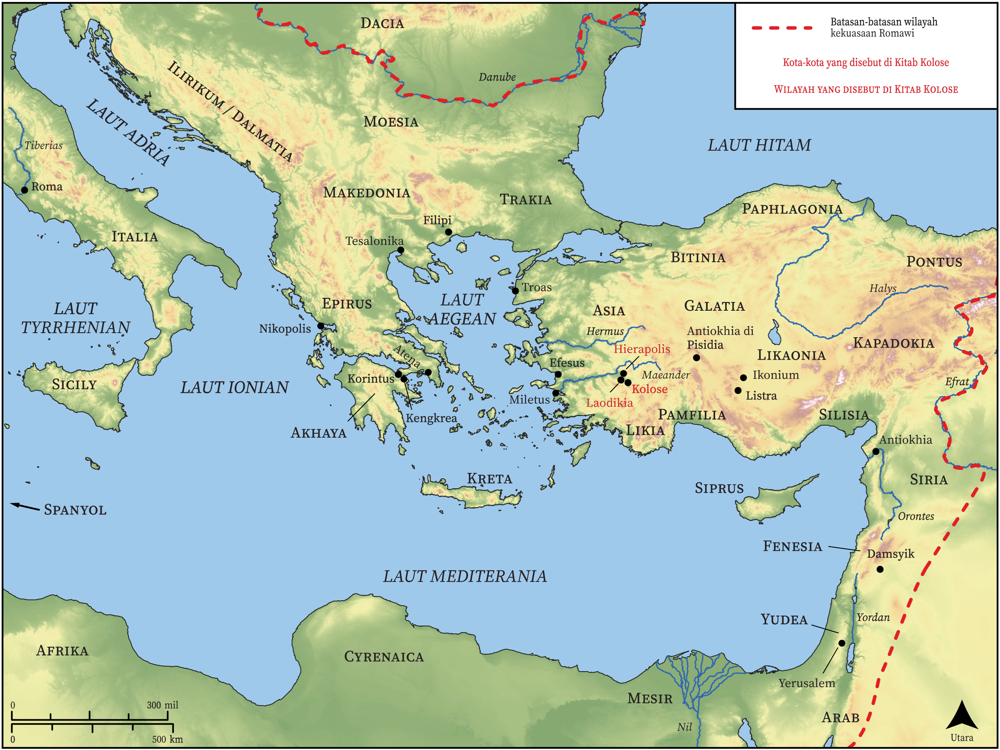

# Peta Alkitab Terbuka Biblica

## License Information

Biblica Open Bible Maps, © 2023–2025 Biblica, Inc. This work is licensed under Creative Commons Attribution-ShareAlike 4.0 International (https://creativecommons.org/licenses/by-sa/4.0/). More Information: https://docs.google.com/document/d/1Pp44yZ0Zdnd59vJHTrt2rPYq0SppfX5rZbPBt6mz37U/edit?tab=t.0#heading=h.oev9aj1ksvk2

--------------------------------

## Paulus dan Gereja Mula-mula: Kolose (id: NT055)

### Image Content

[link](images/NT055.png)

* **Associated Passages:** Kolose 1:1-4:18

* **Associated ACAI Concepts:** Yesus (ID: `person:Jesus.2`); Tuhan (ID: `deity:Lord`); tubuh (ID: `keyterm:Body.3`); keahlian (ID: `keyterm:Ability`); kasihi (ID: `keyterm:Love`); khusus (ID: `keyterm:Holy`); sorga (ID: `keyterm:Heaven`); percaya (ID: `keyterm:Believe`); berdoa (ID: `keyterm:Pray`); hati (ID: `keyterm:Heart`); kebaikan (ID: `keyterm:Favor`); Laodikia (ID: `place:Laodicea`); jemaat (ID: `keyterm:Church`); kekasih (ID: `keyterm:Beloved`); hidup (ID: `keyterm:Live.3`); kesetiaan (ID: `keyterm:Faithfulness`); kehidupan (ID: `keyterm:Life`); kekuasaan (ID: `keyterm:Authority.2`); memperdamaikan (ID: `keyterm:Peace`); Paulus (ID: `person:Paul`); penyunatan (ID: `keyterm:Circumcision`); harapan (ID: `keyterm:Hope`); mengampuni (ID: `keyterm:Forgive`); dalam kristus (ID: `keyterm:InChrist`); Epafras (ID: `person:Epaphras`); roh, roh dunia (ID: `keyterm:FundamentalPrinciples`); meminta (ID: `keyterm:AskFor`); memberitakan (ID: `keyterm:Proclaim`); kebenaran (ID: `keyterm:Truth`); injil (ID: `keyterm:GoodNews`)
