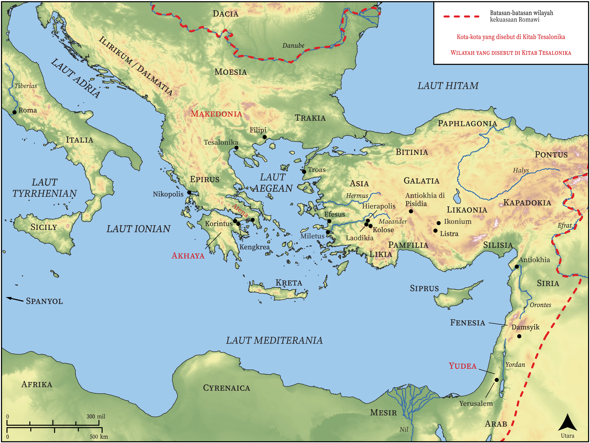

# Peta Alkitab Terbuka Biblica

## License Information

Biblica Open Bible Maps, © 2023–2025 Biblica, Inc. This work is licensed under Creative Commons Attribution-ShareAlike 4.0 International (https://creativecommons.org/licenses/by-sa/4.0/). More Information: https://docs.google.com/document/d/1Pp44yZ0Zdnd59vJHTrt2rPYq0SppfX5rZbPBt6mz37U/edit?tab=t.0#heading=h.oev9aj1ksvk2

--------------------------------

## Paulus dan Gereja Mula-mula: Tesalonika (id: NT056)

### Image Content

[link](images/NT056.png)

* **Associated Passages:** 1 Tesalonika 1:1-5:28; 2 Tesalonika 1:1-3:18

* **Associated ACAI Concepts:** Yesus (ID: `person:Jesus.2`); Tuhan (ID: `deity:Lord`); percaya (ID: `keyterm:Believe`); meminta (ID: `keyterm:AskFor`); kasihi (ID: `keyterm:Love`); injil (ID: `keyterm:GoodNews`); kebaikan (ID: `keyterm:Favor`); hati (ID: `keyterm:Heart`); kemuliaan (ID: `keyterm:Glory`); menasihati (ID: `keyterm:Encourage`); dikhususkan (ID: `keyterm:Consecration.2`); berdoa (ID: `keyterm:Pray`); keselamatan (ID: `keyterm:Salvation`); hidup (ID: `keyterm:Live.3`); memperdamaikan (ID: `keyterm:Peace`); Roh (ID: `deity:HolySpirit`); keahlian (ID: `keyterm:Ability`); kehidupan (ID: `keyterm:Life`); harapan (ID: `keyterm:Hope`); yang baik (ID: `keyterm:Good`); Cause of Joy (ID: `keyterm:CauseOfJoy`); Timotius (ID: `person:Timothy`); jemaat (ID: `keyterm:Church`); Paulus (ID: `person:Paul`); khusus (ID: `keyterm:Holy`); Makedonia (ID: `place:Macedonia`); tak kenal hukum (ID: `keyterm:Lawless`); lepas atau bebas dari sumpah (ID: `keyterm:Blameless`); sorga (ID: `keyterm:Heaven`); dalam kristus (ID: `keyterm:InChrist`)
