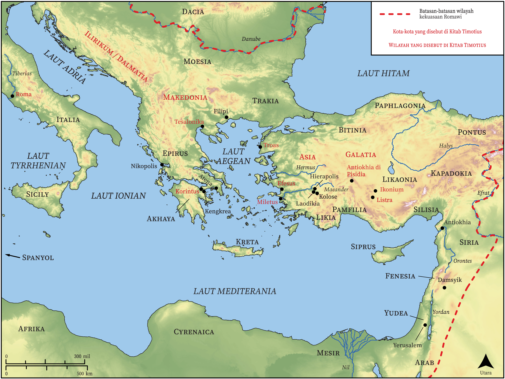

# Peta Alkitab Terbuka Biblica

## License Information

Biblica Open Bible Maps, © 2023–2025 Biblica, Inc. This work is licensed under Creative Commons Attribution-ShareAlike 4.0 International (https://creativecommons.org/licenses/by-sa/4.0/). More Information: https://docs.google.com/document/d/1Pp44yZ0Zdnd59vJHTrt2rPYq0SppfX5rZbPBt6mz37U/edit?tab=t.0#heading=h.oev9aj1ksvk2

--------------------------------

## Paulus dan Gereja Mula-mula: Timotius (id: NT057)

### Image Content

[link](images/NT057.png)

* **Associated Passages:** 1 Timotius 1:1-6:21; 2 Timotius 1:1-4:22

* **Associated ACAI Concepts:** Yesus (ID: `person:Jesus.2`); Tuhan (ID: `deity:Lord`); percaya (ID: `keyterm:Believe`); kesetiaan (ID: `keyterm:Faithfulness`); kehidupan (ID: `keyterm:Life`); kebaikan (ID: `keyterm:Favor`); kasihi (ID: `keyterm:Love`); kebenaran (ID: `keyterm:Truth`); dalam kristus (ID: `keyterm:InChrist`); selama, lamanya (ID: `keyterm:Always`); keahlian (ID: `keyterm:Ability`); keselamatan (ID: `keyterm:Salvation`); melayani (ID: `keyterm:Serve`); meminta (ID: `keyterm:AskFor`); belas kasihan (ID: `keyterm:Mercy`); menjadi (atau menunjukkan diri) tidak bersalah (ID: `keyterm:Just`); yang baik (ID: `keyterm:Good`); hati nurani (ID: `keyterm:Conscience`); bersaksi (ID: `keyterm:BearWitness`); kemuliaan (ID: `keyterm:Glory`); harapan (ID: `keyterm:Hope`); Timotius (ID: `person:Timothy`); biasa (ID: `keyterm:Profane`); injil (ID: `keyterm:GoodNews`); janji (ID: `keyterm:Promise`); berbuat dosa (ID: `keyterm:Sin`); berdoa (ID: `keyterm:Pray`); Roh (ID: `deity:HolySpirit`); suci (ID: `keyterm:Clean`); hati (ID: `keyterm:Heart`)
