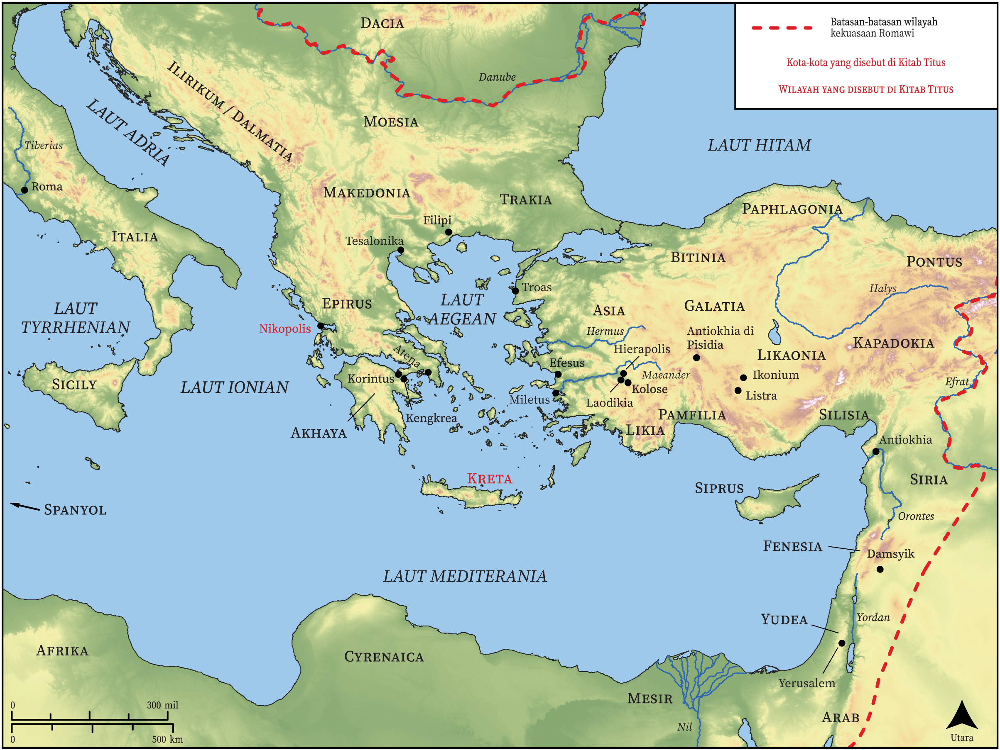

# Peta Alkitab Terbuka Biblica

## License Information

Biblica Open Bible Maps, © 2023–2025 Biblica, Inc. This work is licensed under Creative Commons Attribution-ShareAlike 4.0 International (<a href="https://creativecommons.org/licenses/by-sa/4.0/">https://creativecommons.org/licenses/by-sa/4.0/</a>). More Information: <a href="https://docs.google.com/document/d/1Pp44yZ0Zdnd59vJHTrt2rPYq0SppfX5rZbPBt6mz37U/edit?tab=t.0#heading=h.oev9aj1ksvk2">https://docs.google.com/document/d/1Pp44yZ0Zdnd59vJHTrt2rPYq0SppfX5rZbPBt6mz37U/edit?tab=t.0#heading=h.oev9aj1ksvk2</a>

--------------------------------

## Paulus dan Gereja Mula-mula: Titus (id: NT058)

### Image Content

[link](images/NT058.png)

* **Associated Passages:** Titus 1:1-3:15

* **Associated ACAI Concepts:** Tuhan (ID: `deity:Lord`); percaya (ID: `keyterm:Believe`); juruselamat (ID: `keyterm:Savior`); kebaikan (ID: `keyterm:Favor`); Yesus (ID: `person:Jesus.2`); yang baik (ID: `keyterm:Good`); menjadi (atau menunjukkan diri) tidak bersalah (ID: `keyterm:Just`); selama, lamanya (ID: `keyterm:Always`); meminta (ID: `keyterm:AskFor`); kesetiaan (ID: `keyterm:Faithfulness`); harapan (ID: `keyterm:Hope`); kehidupan (ID: `keyterm:Life`); tak bercacat (ID: `keyterm:WithoutReproach`); Kreta (ID: `place:Crete`); menghujat (ID: `keyterm:Blaspheme`); keahlian (ID: `keyterm:Ability`); menasihati (ID: `keyterm:Encourage`); kebenaran (ID: `keyterm:Truth`); keselamatan (ID: `keyterm:Salvation`); kekuasaan (ID: `keyterm:Authority.2`); Cretans (ID: `group:Cretan`); suci (ID: `keyterm:Clean`); Cretan Prophet (ID: `person:CretanProphet`); Artemas (ID: `person:Artemas`); Titus (ID: `person:Titus`); ramah (ID: `keyterm:Gentle`); sia, sia (ID: `keyterm:Worthless`); Nikopolis (ID: `place:Nicopolis`); Zenas (ID: `person:Zenas`); penyunatan (ID: `keyterm:Circumcision`); perintah (ID: `keyterm:Commandment`); Tikhikus (ID: `person:Tychicus`); memutuskan (ID: `keyterm:Decided`); (kepunyaan) bersama (ID: `keyterm:InCommon`); penebusan (ID: `keyterm:Liberation`); murni (ID: `keyterm:Pure`); kebaikan (ID: `keyterm:Kindness`); memperdamaikan (ID: `keyterm:Peace`); Jews (ID: `group:Jews`); janji (ID: `keyterm:Promise`); suka akan yang baik (ID: `keyterm:LikingWhatIsGood`); pencemaran (ID: `keyterm:Defilement`); kemuliaan (ID: `keyterm:Glory`); tak kenal hukum (ID: `keyterm:Lawless`); hati nurani (ID: `keyterm:Conscience`); khusus (ID: `keyterm:Holy`); tidak setia (ID: `keyterm:Unfaithful`); berbahagialah (ID: `keyterm:Happy`); menghukum dirinya sendiri (ID: `keyterm:SelfCondemned`); persahabatan (ID: `keyterm:Friendship`); memberitakan (ID: `keyterm:Proclaim`); belas kasihan (ID: `keyterm:Mercy`); benar (ID: `keyterm:True`); melayani (ID: `keyterm:Serve.2`); membersihkan (ID: `keyterm:Cleanse.2`); berbuat dosa (ID: `keyterm:Sin`); duniawi (ID: `keyterm:Worldly`); kasihi (ID: `keyterm:Love`); Apolos (ID: `person:Apollos`); tidak bercela (ID: `keyterm:BeyondReproach`); orang pilihan (ID: `keyterm:Chosen`); Paulus (ID: `person:Paul`); bersaksi (ID: `keyterm:BearWitness`); yang mendukung suami (ID: `keyterm:HavingLoveForOnesHusband`); Roh (ID: `deity:HolySpirit`); Wine (ID: `realia:Wine`)
