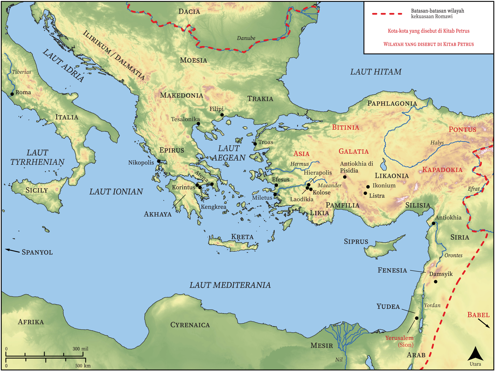

# Peta Alkitab Terbuka Biblica

## License Information

Biblica Open Bible Maps, © 2023–2025 Biblica, Inc. This work is licensed under Creative Commons Attribution-ShareAlike 4.0 International (<a href="https://creativecommons.org/licenses/by-sa/4.0/">https://creativecommons.org/licenses/by-sa/4.0/</a>). More Information: <a href="https://docs.google.com/document/d/1Pp44yZ0Zdnd59vJHTrt2rPYq0SppfX5rZbPBt6mz37U/edit?tab=t.0#heading=h.oev9aj1ksvk2">https://docs.google.com/document/d/1Pp44yZ0Zdnd59vJHTrt2rPYq0SppfX5rZbPBt6mz37U/edit?tab=t.0#heading=h.oev9aj1ksvk2</a>

--------------------------------

## Paulus dan Gereja Mula-mula: Petrus (id: NT059)

### Image Content

[link](images/NT059.png)

* **Associated Passages:** 1 Petrus 1:1-5:14; 2 Petrus 1:1-3:18

* **Associated ACAI Concepts:** Tuhan (ID: `deity:Lord`); Yesus (ID: `person:Jesus.2`); kemuliaan (ID: `keyterm:Glory`); keahlian (ID: `keyterm:Ability`); kebaikan (ID: `keyterm:Favor`); menjadi (atau menunjukkan diri) tidak bersalah (ID: `keyterm:Just`); tubuh (ID: `keyterm:Body.3`); khusus (ID: `keyterm:Holy`); kehidupan (ID: `keyterm:Life`); percaya (ID: `keyterm:Believe`); sorga (ID: `keyterm:Heaven`); keselamatan (ID: `keyterm:Salvation`); kasihi (ID: `keyterm:Love`); berbuat dosa (ID: `keyterm:Sin`); kekasih (ID: `keyterm:Beloved`); takut (ID: `keyterm:Fear`); yang baik (ID: `keyterm:Good`); penghakiman (ID: `keyterm:Judgment`); selama, lamanya (ID: `keyterm:Always`); janji (ID: `keyterm:Promise`); orang pilihan (ID: `keyterm:Chosen`); harapan (ID: `keyterm:Hope`); lakukan baik (ID: `keyterm:DoGood`); hati (ID: `keyterm:Heart`); memperdamaikan (ID: `keyterm:Peace`); juruselamat (ID: `keyterm:Savior`); Roh (ID: `deity:HolySpirit`); menghujat (ID: `keyterm:Blaspheme`); injil (ID: `keyterm:GoodNews`); memutuskan (ID: `keyterm:Decided`)
