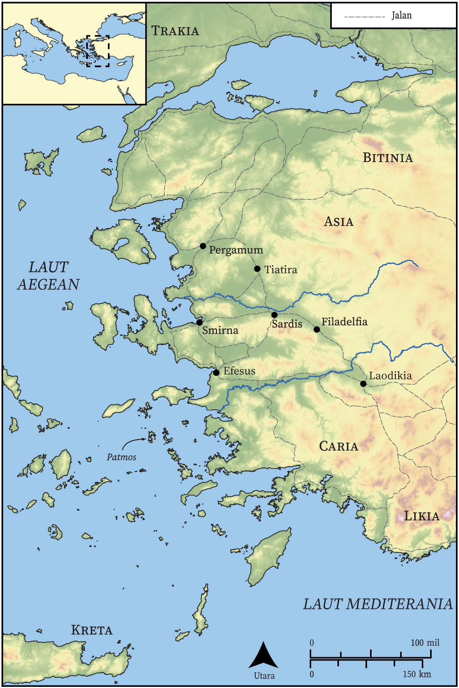

# Peta Alkitab Terbuka Biblica

## License Information

Biblica Open Bible Maps, © 2023–2025 Biblica, Inc. This work is licensed under Creative Commons Attribution-ShareAlike 4.0 International (https://creativecommons.org/licenses/by-sa/4.0/). More Information: https://docs.google.com/document/d/1Pp44yZ0Zdnd59vJHTrt2rPYq0SppfX5rZbPBt6mz37U/edit?tab=t.0#heading=h.oev9aj1ksvk2

--------------------------------

## Paulus dan Gereja Mula-mula: Wahyu (id: NT060)

### Image Content

[link](images/NT060.png)

* **Associated Passages:** Wahyu 1:1-22:21

* **Associated ACAI Concepts:** Tuhan (ID: `deity:Lord`); An Angel (ID: `deity:Angel`); sorga (ID: `keyterm:Heaven`); keahlian (ID: `keyterm:Ability`); nama (ID: `keyterm:Name`); kehidupan (ID: `keyterm:Life`); khusus (ID: `keyterm:Holy`); menyembah (ID: `keyterm:BowDown`); kemuliaan (ID: `keyterm:Glory`); kekuasaan (ID: `keyterm:Authority.2`); Yesus (ID: `person:Jesus.2`); jemaat (ID: `keyterm:Church`); darah (ID: `keyterm:Blood`); selama, lamanya (ID: `keyterm:Always`); Roh (ID: `deity:HolySpirit`); bersaksi (ID: `keyterm:BearWitness`); persundalan (ID: `keyterm:Fornication`); A Disembodied Voice (ID: `deity:Voice`); benar (ID: `keyterm:True`); bertobat (ID: `keyterm:Repent`); kerajaan (ID: `keyterm:Kingdom`); bertindak jahat (ID: `keyterm:ActWickedly`); memutuskan (ID: `keyterm:Decided`); takut (ID: `keyterm:Fear`); jurang maut (ID: `keyterm:Abyss`); kesetiaan (ID: `keyterm:Faithfulness`); menghujat (ID: `keyterm:Blaspheme`); roh (ID: `keyterm:Spirit.2`); berbahagialah (ID: `keyterm:Happy`); amin! (ID: `keyterm:Surely`)
