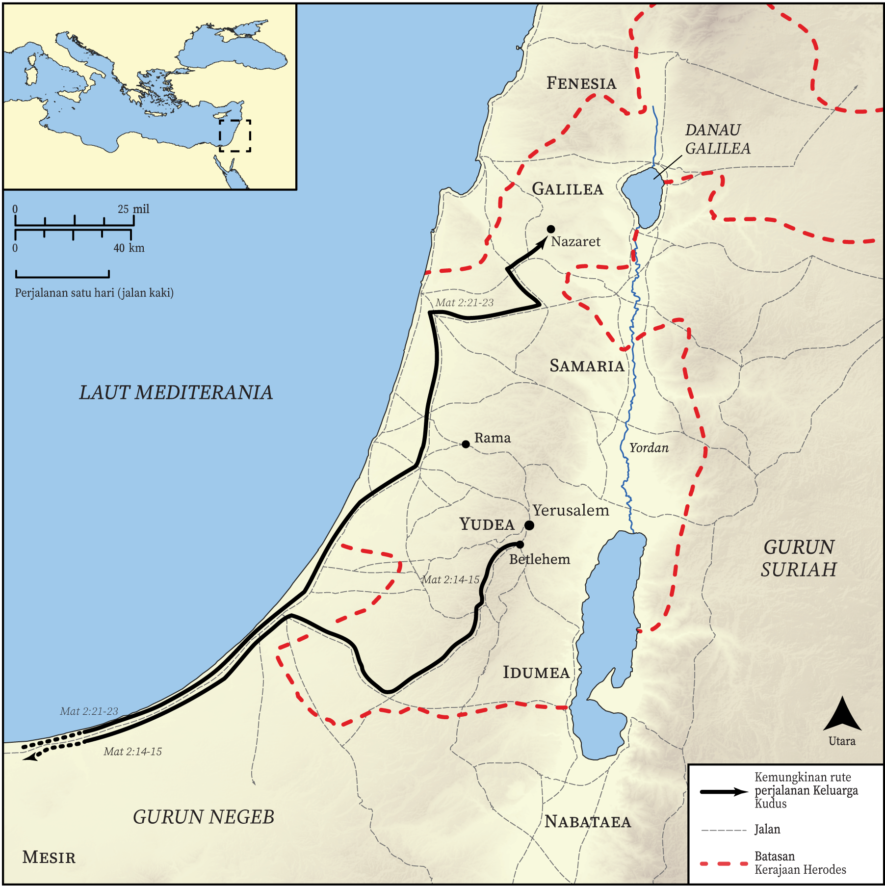

# Peta Alkitab Terbuka Biblica

## License Information

Biblica Open Bible Maps, © 2023–2025 Biblica, Inc. This work is licensed under Creative Commons Attribution-ShareAlike 4.0 International (<a href="https://creativecommons.org/licenses/by-sa/4.0/">https://creativecommons.org/licenses/by-sa/4.0/</a>). More Information: <a href="https://docs.google.com/document/d/1Pp44yZ0Zdnd59vJHTrt2rPYq0SppfX5rZbPBt6mz37U/edit?tab=t.0#heading=h.oev9aj1ksvk2">https://docs.google.com/document/d/1Pp44yZ0Zdnd59vJHTrt2rPYq0SppfX5rZbPBt6mz37U/edit?tab=t.0#heading=h.oev9aj1ksvk2</a>

--------------------------------

## Kehidupan Yesus: Kelahiran Yesus (id: NT010)

### Image Content

[link](images/NT010.png)

* **Associated Passages:** Matius 2:1-23; Lukas 2:1-52

* **Associated ACAI Concepts:** Tuhan (ID: `deity:Lord`); Herodes (ID: `person:Herod`); Yerusalem (ID: `place:Jerusalem`); Yesus (ID: `person:Jesus.2`); Betlehem (ID: `place:Bethlehem`); An Angel (ID: `deity:Angel`); Israel (ID: `person:Israel`); firman (ID: `keyterm:Word`); hukum (ID: `keyterm:Law`); Maria (ID: `person:Mary`); Nazaret (ID: `place:Nazareth`); Yusuf (ID: `person:Joseph.4`); Mesir (ID: `place:Egypt`); Yehuda (ID: `place:Judea`); kemuliaan (ID: `keyterm:Glory`); Flock (ID: `fauna:Flock`); Goat (ID: `fauna:Goat`); menyembah (ID: `keyterm:BowDown`); menggenapi (ID: `keyterm:Happen`); Galilea (ID: `place:Galilee`); hati (ID: `keyterm:Heart`); takut (ID: `keyterm:Fear`); mendaftarkan (ID: `keyterm:Register`); Roh (ID: `deity:HolySpirit`); Sheep (ID: `fauna:Lamb`); Simeon (ID: `person:Simeon.2`); Cause of Joy (ID: `keyterm:CauseOfJoy`); khusus (ID: `keyterm:Holy`); kebaikan (ID: `keyterm:Favor`); persembahan (ID: `keyterm:Offering`)
