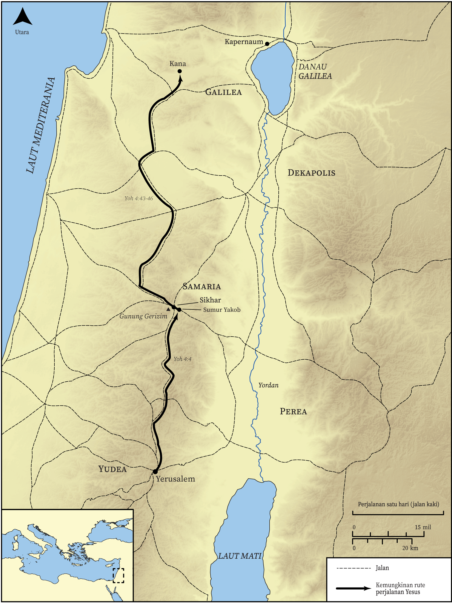

# Peta Alkitab Terbuka Biblica

## License Information

Biblica Open Bible Maps, © 2023–2025 Biblica, Inc. This work is licensed under Creative Commons Attribution-ShareAlike 4.0 International (<a href="https://creativecommons.org/licenses/by-sa/4.0/">https://creativecommons.org/licenses/by-sa/4.0/</a>). More Information: <a href="https://docs.google.com/document/d/1Pp44yZ0Zdnd59vJHTrt2rPYq0SppfX5rZbPBt6mz37U/edit?tab=t.0#heading=h.oev9aj1ksvk2">https://docs.google.com/document/d/1Pp44yZ0Zdnd59vJHTrt2rPYq0SppfX5rZbPBt6mz37U/edit?tab=t.0#heading=h.oev9aj1ksvk2</a>

--------------------------------

## Kehidupan Yesus: Perjalanan Yesus melalui Samaria (id: NT013)

### Image Content

[link](images/NT013.png)

* **Associated Passages:** Yohanes 4:1-54

* **Associated ACAI Concepts:** Yesus (ID: `person:Jesus.2`); percaya (ID: `keyterm:Believe`); kehidupan (ID: `keyterm:Life`); Galilea (ID: `place:Galilee`); menjadi murid (ID: `keyterm:Disciple`); Samaria (ID: `place:Samaria`); menyembah (ID: `keyterm:BowDown`); Tuhan (ID: `deity:Lord`); benar (ID: `keyterm:True`); A Woman (ID: `person:GenericFemale`); Yerusalem (ID: `place:Jerusalem`); Samaritans (ID: `group:Samaritan`); Yehuda (ID: `place:Judea`); Israel (ID: `person:Israel`); meminta (ID: `keyterm:AskFor`); roh (ID: `keyterm:Spirit.2`); selama, lamanya (ID: `keyterm:Always`); kebenaran (ID: `keyterm:Truth`); tanda (ID: `keyterm:Example`); baptisan (ID: `keyterm:Baptism`); bersaksi (ID: `keyterm:BearWitness`); Jews (ID: `group:Jews`); Galileans (ID: `group:Galilee`); Kana (ID: `place:Cana`); Sikhar (ID: `place:Sychar`); A Person (ID: `person:GenericPerson`); A Group of Disciples (ID: `group:GenericDisciples`); mujizat (ID: `keyterm:Portent`); Yohanes (ID: `person:John`); keselamatan (ID: `keyterm:Salvation`)
