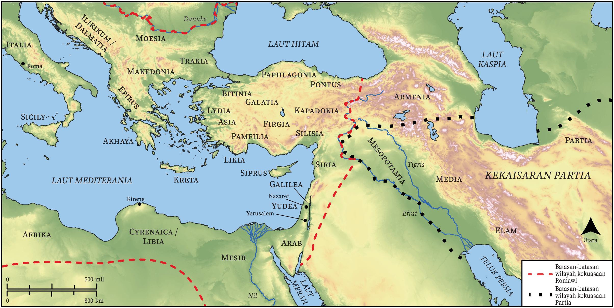

# Peta Alkitab Terbuka Biblica

## License Information

Biblica Open Bible Maps, © 2023–2025 Biblica, Inc. This work is licensed under Creative Commons Attribution-ShareAlike 4.0 International (<a href="https://creativecommons.org/licenses/by-sa/4.0/">https://creativecommons.org/licenses/by-sa/4.0/</a>). More Information: <a href="https://docs.google.com/document/d/1Pp44yZ0Zdnd59vJHTrt2rPYq0SppfX5rZbPBt6mz37U/edit?tab=t.0#heading=h.oev9aj1ksvk2">https://docs.google.com/document/d/1Pp44yZ0Zdnd59vJHTrt2rPYq0SppfX5rZbPBt6mz37U/edit?tab=t.0#heading=h.oev9aj1ksvk2</a>

--------------------------------

## Paulus dan Gereja Mula-mula: Perkumpulan pada Hari Pentakosta (id: NT031)

### Image Content

[link](images/NT031.png)

* **Associated Passages:** Kisah Para Rasul 2:1-47

* **Associated ACAI Concepts:** Tuhan (ID: `deity:Lord`); Yesus (ID: `person:Jesus.2`); Roh (ID: `deity:HolySpirit`); sorga (ID: `keyterm:Heaven`); mujizat (ID: `keyterm:Portent`); Petrus (ID: `person:Peter`); keselamatan (ID: `keyterm:Salvation`); hati (ID: `keyterm:Heart`); tubuh (ID: `keyterm:Body.3`); Daud (ID: `person:David`); tanda (ID: `keyterm:Example`); baptisan (ID: `keyterm:Baptism`); alam maut (ID: `keyterm:WorldOfTheDead`); Yerusalem (ID: `place:Jerusalem`); kepenuhan (roh) seperti nabi (ID: `keyterm:Speak`); Yehuda (ID: `place:Judea`); Israel (ID: `person:Israel`); janji (ID: `keyterm:Promise`); nama (ID: `keyterm:Name`); Hell (ID: `place:Hell`); darah (ID: `keyterm:Blood`); Jews (ID: `group:Jews`); Parthians (ID: `group:Parthians`); persekutuan (ID: `keyterm:Fellowship`); Cretans (ID: `group:Cretan`); berdoa (ID: `keyterm:CallUpon`); bertobat (ID: `keyterm:Repent`); Kirene (ID: `place:Cyrene`); Judeans (ID: `group:Judea`); Kapadokia (ID: `place:Cappadocia`); firman (ID: `keyterm:Word`); kebangkitan (ID: `keyterm:Resurrection`); Media (ID: `person:Medan`); Yoël (ID: `person:Joel.14`); Elam (ID: `place:Elam`); Libia (ID: `place:Libya`); Pontus (ID: `place:Pontus`); Elamites (ID: `group:Elam`); Galileans (ID: `group:Galilee`); Frigia (ID: `place:Phrygia`); berbuat dosa (ID: `keyterm:Sin`); harapan (ID: `keyterm:Hope`); mengampuni (ID: `keyterm:Forgive`); Be Lawful (ID: `keyterm:Lawful`); khusus (ID: `keyterm:Holy`); berdoa (ID: `keyterm:Pray`); tak kenal hukum (ID: `keyterm:Lawless`); Kreta (ID: `place:Crete`); memberi kesaksian yang sungguh, sungguh (ID: `keyterm:Declare`); kebaikan (ID: `keyterm:Favor`); Nazaret (ID: `place:Nazareth`); Asia (ID: `place:Asia`); sumpah (ID: `keyterm:Oath`); Galilea (ID: `place:Galilee`); Medes (ID: `group:Mede`); percaya (ID: `keyterm:Believe`); Mesir (ID: `place:Egypt`); Pamfilia (ID: `place:Pamphylia`); Israelites (ID: `group:Israel`); perbuatan besar (ID: `keyterm:MightyAct`); Arab (ID: `place:Arabia`); takut (ID: `keyterm:Fear`); Roma (ID: `place:Rome`); keahlian (ID: `keyterm:Ability`); Aram-Mesopotamia (ID: `place:Mesopotamia`); apa yang sebenarnya terjadi (ID: `keyterm:SomethingDefinite`); Arabians (ID: `group:Arabia`); saksi (ID: `keyterm:Witness`); meminta (ID: `keyterm:AskFor`); kehidupan (ID: `keyterm:Life`); (kepunyaan) bersama (ID: `keyterm:InCommon`); House (ID: `realia:House`); Cross (ID: `realia:Cross`); Temple (ID: `realia:Temple`); Sweet Wine (ID: `realia:SweetWine`); Throne (ID: `realia:Throne`); Footstool (ID: `realia:Footstool`); Grave (ID: `realia:Grave`)
