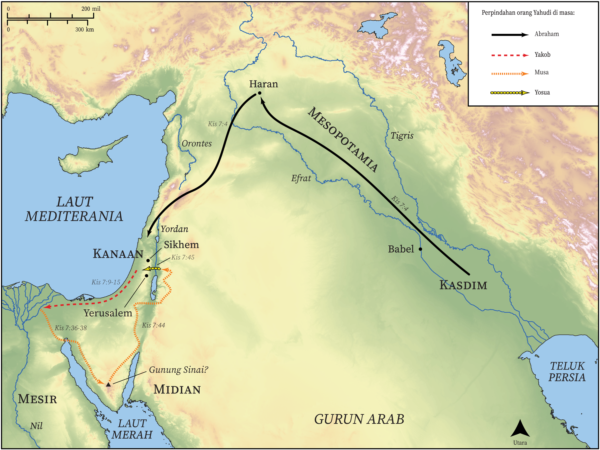

# Peta Alkitab Terbuka Biblica

## License Information

Biblica Open Bible Maps, © 2023–2025 Biblica, Inc. This work is licensed under Creative Commons Attribution-ShareAlike 4.0 International (<a href="https://creativecommons.org/licenses/by-sa/4.0/">https://creativecommons.org/licenses/by-sa/4.0/</a>). More Information: <a href="https://docs.google.com/document/d/1Pp44yZ0Zdnd59vJHTrt2rPYq0SppfX5rZbPBt6mz37U/edit?tab=t.0#heading=h.oev9aj1ksvk2">https://docs.google.com/document/d/1Pp44yZ0Zdnd59vJHTrt2rPYq0SppfX5rZbPBt6mz37U/edit?tab=t.0#heading=h.oev9aj1ksvk2</a>

--------------------------------

## Paulus dan Gereja Mula-mula: Stefanus Menceritakan Sejarah Bangsa Yahudi (id: NT033)

### Image Content

[link](images/NT033.png)

* **Associated Passages:** Kisah Para Rasul 7:1-60

* **Associated ACAI Concepts:** Tuhan (ID: `deity:Lord`); Mesir (ID: `place:Egypt`); Israel (ID: `person:Israel`); Musa (ID: `person:Moses`); Yusuf (ID: `person:Joseph.10`); An Angel (ID: `deity:Angel`); Abraham (ID: `person:Abraham`); sorga (ID: `keyterm:Heaven`); bertindak jahat (ID: `keyterm:ActWickedly`); Egyptians (ID: `group:Egypt`); hati (ID: `keyterm:Heart`); Yesus (ID: `person:Jesus.2`); melepaskan (ID: `keyterm:Rescue`); Firaun (ID: `person:Pharaoh.4`); Ishak (ID: `person:Isaac`); imamat (ID: `keyterm:Priesthood`); hakim (ID: `keyterm:Judge`); Sinai (ID: `place:SinaiMount`); Haran (ID: `place:Haran`); kebaikan (ID: `keyterm:Favor`); kemuliaan (ID: `keyterm:Glory`); janji (ID: `keyterm:Promise`); persembahan (ID: `keyterm:Offering`); Roh (ID: `deity:HolySpirit`); melayani (ID: `keyterm:Serve`); Hemor (ID: `person:Hamor`); berdoa (ID: `keyterm:CallUpon`); Refan (ID: `deity:Rephan`); Sekhem (ID: `place:Shechem`); Aram-Mesopotamia (ID: `place:Mesopotamia`)
