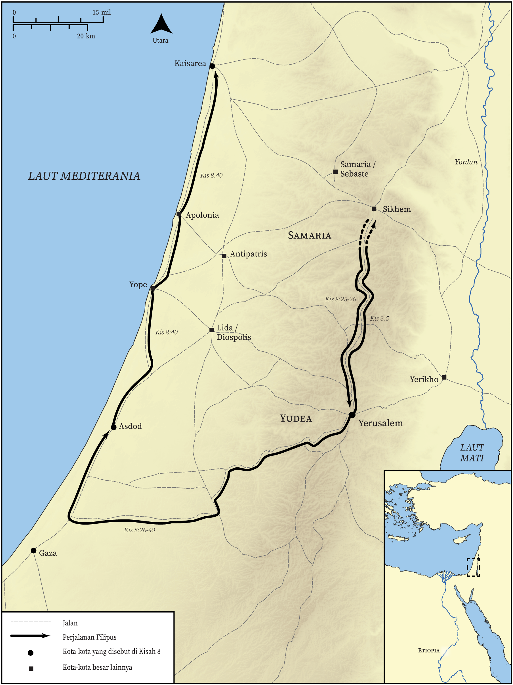

# Peta Alkitab Terbuka Biblica

## License Information

Biblica Open Bible Maps, © 2023–2025 Biblica, Inc. This work is licensed under Creative Commons Attribution-ShareAlike 4.0 International (<a href="https://creativecommons.org/licenses/by-sa/4.0/">https://creativecommons.org/licenses/by-sa/4.0/</a>). More Information: <a href="https://docs.google.com/document/d/1Pp44yZ0Zdnd59vJHTrt2rPYq0SppfX5rZbPBt6mz37U/edit?tab=t.0#heading=h.oev9aj1ksvk2">https://docs.google.com/document/d/1Pp44yZ0Zdnd59vJHTrt2rPYq0SppfX5rZbPBt6mz37U/edit?tab=t.0#heading=h.oev9aj1ksvk2</a>

--------------------------------

## Paulus dan Gereja Mula-mula: Perjalanan Filipus (id: NT034)

### Image Content

[link](images/NT034.png)

* **Associated Passages:** Kisah Para Rasul 8:1-40

* **Associated ACAI Concepts:** Filipus (ID: `person:Philip.4`); Tuhan (ID: `deity:Lord`); Roh (ID: `deity:HolySpirit`); Yerusalem (ID: `place:Jerusalem`); injil (ID: `keyterm:GoodNews`); baptisan (ID: `keyterm:Baptism`); Samaria (ID: `place:Samaria`); Yesus (ID: `person:Jesus.2`); meminta (ID: `keyterm:AskFor`); Simon (ID: `person:Simon.8`); Public Official (ID: `person:GenericOfficial`); nama (ID: `keyterm:Name`); keahlian (ID: `keyterm:Ability`); Chariot (ID: `realia:Chariot`); percaya (ID: `keyterm:Believe`); hati (ID: `keyterm:Heart`); jemaat (ID: `keyterm:Church`); Paulus (ID: `person:Paul`); kitab suci (ID: `keyterm:Scripture`); tanda (ID: `keyterm:Example`); Petrus (ID: `person:Peter`); Yesaya (ID: `person:Isaiah`); Money (ID: `realia:Money`); Yehuda (ID: `place:Judea`); Gaza (ID: `place:Gaza`); Ethiopians (ID: `group:Ethiopia`); Asdod (ID: `place:Ashdod`); memberitakan (ID: `keyterm:Proclaim`); Etiopia (ID: `place:Ethiopia`); Stefanus (ID: `person:Stephen`); bertobat (ID: `keyterm:Repent`); berdoa (ID: `keyterm:Pray`); menyembah (ID: `keyterm:BowDown`); lalim (ID: `keyterm:UnjustDeed`); memberi kesaksian yang sungguh, sungguh (ID: `keyterm:Declare`); kebenaran (ID: `keyterm:Straightness`); Kaisarea (ID: `place:Caesarea`); Samaritans (ID: `group:Samaritan`); Cause of Joy (ID: `keyterm:CauseOfJoy`); Yohanes (ID: `person:John.2`); melayani (ID: `keyterm:Serve`); kekuasaan (ID: `keyterm:Authority.2`); kerajaan (ID: `keyterm:Kingdom`); mengampuni (ID: `keyterm:Forgive`); kehidupan (ID: `keyterm:Life`); An Angel (ID: `deity:Angel`); Simon (ID: `person:Simon.9`); Sheep (ID: `fauna:Lamb`); House (ID: `realia:House`); Prison (ID: `realia:Prison`); Temple (ID: `realia:Temple`)
