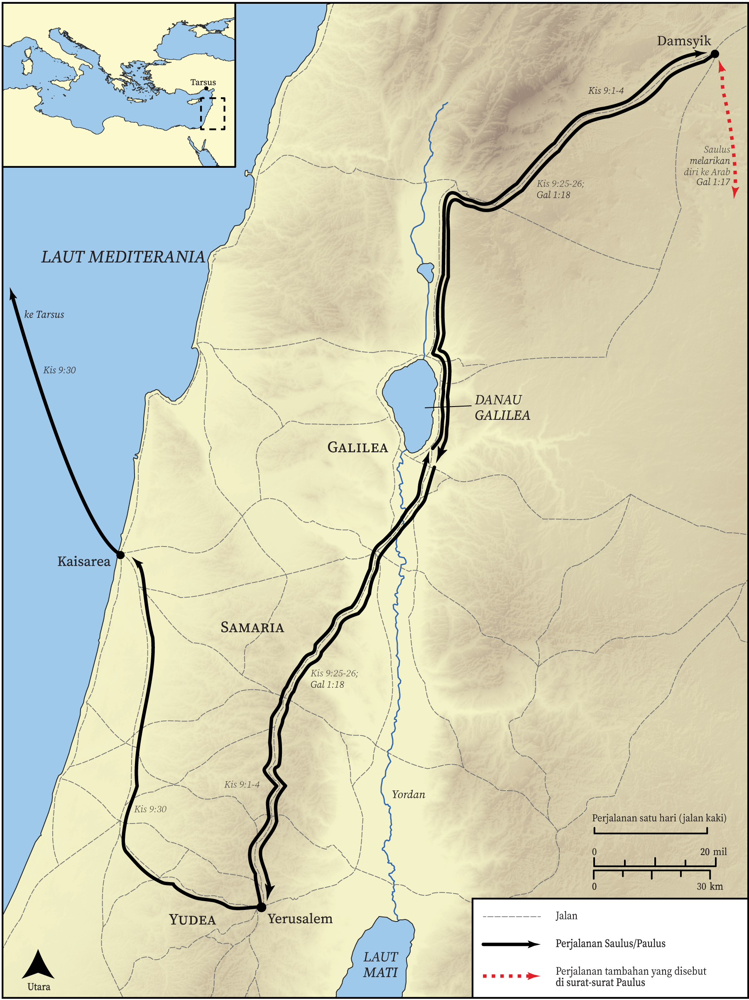

# Peta Alkitab Terbuka Biblica

## License Information

Biblica Open Bible Maps, © 2023–2025 Biblica, Inc. This work is licensed under Creative Commons Attribution-ShareAlike 4.0 International (<a href="https://creativecommons.org/licenses/by-sa/4.0/">https://creativecommons.org/licenses/by-sa/4.0/</a>). More Information: <a href="https://docs.google.com/document/d/1Pp44yZ0Zdnd59vJHTrt2rPYq0SppfX5rZbPBt6mz37U/edit?tab=t.0#heading=h.oev9aj1ksvk2">https://docs.google.com/document/d/1Pp44yZ0Zdnd59vJHTrt2rPYq0SppfX5rZbPBt6mz37U/edit?tab=t.0#heading=h.oev9aj1ksvk2</a>

--------------------------------

## Paulus dan Gereja Mula-mula: Pertobatan Paulus (id: NT035)

### Image Content

[link](images/NT035.png)

* **Associated Passages:** Kisah Para Rasul 9:1-43

* **Associated ACAI Concepts:** Yesus (ID: `person:Jesus.2`); nama (ID: `keyterm:Name`); Paulus (ID: `person:Paul`); Damsyik (ID: `place:Damascus`); menjadi murid (ID: `keyterm:Disciple`); Yerusalem (ID: `place:Jerusalem`); Petrus (ID: `person:Peter`); Ananias (ID: `person:Ananias.2`); Yafo (ID: `place:Joppa`); Tabita (ID: `person:Tabitha`); Lod (ID: `place:Lod`); khusus (ID: `keyterm:Holy`); Eneas (ID: `person:Aeneas`); Tarsus (ID: `place:Tarsus`); percaya (ID: `keyterm:Believe`); berdoa (ID: `keyterm:Pray`); takut (ID: `keyterm:Fear`); berdoa (ID: `keyterm:CallUpon`); meminta (ID: `keyterm:AskFor`); Roh (ID: `deity:HolySpirit`); Jews (ID: `group:Jews`); Sharon Plain (ID: `place:Sharon.2`); Tarsus (ID: `group:Tarsus`); Yudas (ID: `person:Judas.4`); Lurus (ID: `place:Straight`); jalan tuhan (ID: `keyterm:TheWay`); Simon (ID: `person:Simon.9`); Hellenists (ID: `group:Hellenist`); Upstairs Room (ID: `realia:UpstairsRoom`); House (ID: `realia:House`); Yehuda (ID: `place:Judea`); tubuh (ID: `keyterm:Body.3`); jemaat (ID: `keyterm:Church`); Israel (ID: `person:Israel`); kebenaran (ID: `keyterm:Straightness`); orang pilihan (ID: `keyterm:Chosen`); Kaisarea (ID: `place:Caesarea`); sorga (ID: `keyterm:Heaven`); Gentiles (ID: `group:Gentile`); memberitakan (ID: `keyterm:Proclaim`); kekuasaan (ID: `keyterm:Authority.2`); baptisan (ID: `keyterm:Baptism`); memperdamaikan (ID: `keyterm:Peace`); Barnabas (ID: `person:Barnabas`); Galilea (ID: `place:Galilee`); kehidupan (ID: `keyterm:Life`); Samaria (ID: `place:Samaria`); keahlian (ID: `keyterm:Ability`); yang baik (ID: `keyterm:Good`); Yunani (ID: `place:Greece`); Basket (ID: `realia:Basket`); Leather (ID: `realia:Leather`); Temple (ID: `realia:Temple`); Tunic (ID: `realia:Tunic.2`); City Wall (ID: `realia:CityWall`); Bed (ID: `realia:Bed`); Synagogue (ID: `realia:Synagogue`); Cloak (ID: `realia:Cloak`)
