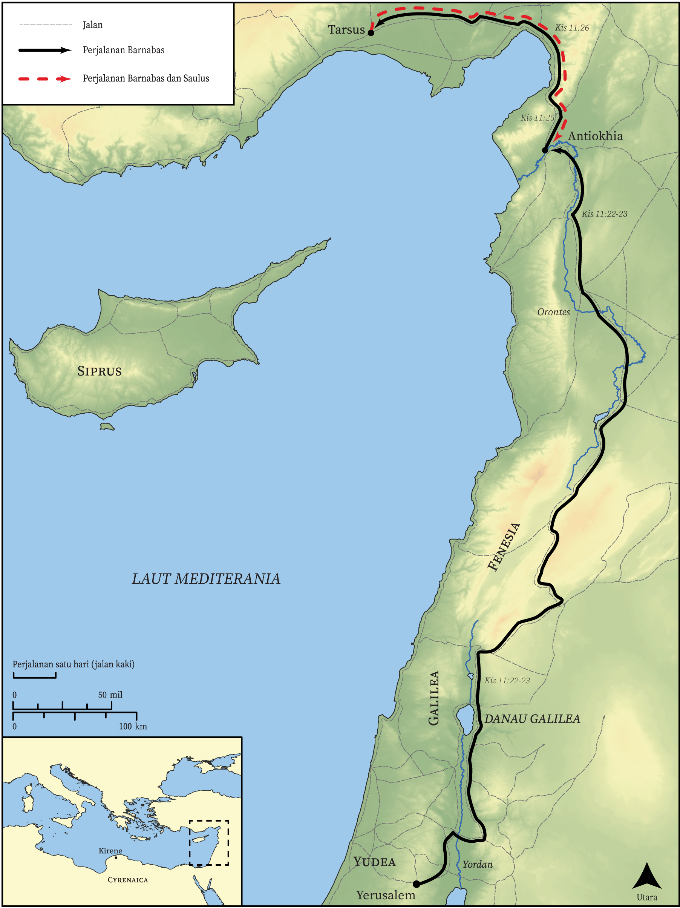

# Peta Alkitab Terbuka Biblica

## License Information

Biblica Open Bible Maps, © 2023–2025 Biblica, Inc. This work is licensed under Creative Commons Attribution-ShareAlike 4.0 International (<a href="https://creativecommons.org/licenses/by-sa/4.0/">https://creativecommons.org/licenses/by-sa/4.0/</a>). More Information: <a href="https://docs.google.com/document/d/1Pp44yZ0Zdnd59vJHTrt2rPYq0SppfX5rZbPBt6mz37U/edit?tab=t.0#heading=h.oev9aj1ksvk2">https://docs.google.com/document/d/1Pp44yZ0Zdnd59vJHTrt2rPYq0SppfX5rZbPBt6mz37U/edit?tab=t.0#heading=h.oev9aj1ksvk2</a>

--------------------------------

## Paulus dan Gereja Mula-mula: Jemaat di Antiokhia (id: NT037)

### Image Content

[link](images/NT037.png)

* **Associated Passages:** Kisah Para Rasul 11:1-30

* **Associated ACAI Concepts:** Tuhan (ID: `deity:Lord`); Antiokhia (ID: `place:Antioch`); Roh (ID: `deity:HolySpirit`); sorga (ID: `keyterm:Heaven`); Yesus (ID: `person:Jesus.2`); Petrus (ID: `person:Peter`); Yerusalem (ID: `place:Jerusalem`); percaya (ID: `keyterm:Believe`); menjadi murid (ID: `keyterm:Disciple`); Siprus (ID: `place:Cyprus`); House (ID: `realia:House`); Yehuda (ID: `place:Judea`); jemaat (ID: `keyterm:Church`); bimbang (ID: `keyterm:Discern`); Paulus (ID: `person:Paul`); pencemaran (ID: `keyterm:Defilement`); firman (ID: `keyterm:Word`); Gentiles (ID: `group:Gentile`); Yafo (ID: `place:Joppa`); Barnabas (ID: `person:Barnabas`); Klaudius (ID: `person:Claudius`); Cypriots (ID: `group:Cyprus`); Fenisia (ID: `place:Phoenicia`); Agabus (ID: `person:Agabus`); Christians (ID: `group:Christ`); Hellenists (ID: `group:Hellenist`); Temple (ID: `realia:Temple`); hati (ID: `keyterm:Heart`); bertobat (ID: `keyterm:Repent`); berdoa (ID: `keyterm:Pray`); penyunatan (ID: `keyterm:Circumcision`); Tarsus (ID: `place:Tarsus`); Kaisarea (ID: `place:Caesarea`); kebaikan (ID: `keyterm:Favor`); Kirene (ID: `place:Cyrene`); Yohanes (ID: `person:John`); keselamatan (ID: `keyterm:Salvation`); injil (ID: `keyterm:GoodNews`); melayani (ID: `keyterm:Serve`); baptisan (ID: `keyterm:Baptism`); nama (ID: `keyterm:Name`); Stefanus (ID: `person:Stephen`); kemuliaan (ID: `keyterm:Glory`); meminta (ID: `keyterm:AskFor`); kehidupan (ID: `keyterm:Life`); Yunani (ID: `place:Greece`); An Angel (ID: `deity:Angel`); membersihkan (ID: `keyterm:Cleanse.2`); Jews (ID: `group:Jews`); keahlian (ID: `keyterm:Ability`); yang baik (ID: `keyterm:Good`); Linen Cloth (ID: `realia:LinenCloth`); Lizard (ID: `fauna:Lizard`); Creeping Animal (ID: `fauna:CreepingAnimal`); Monitor (ID: `fauna:Iguana`); Chameleon (ID: `fauna:Chameleon`); Snake (ID: `fauna:Snake`)
