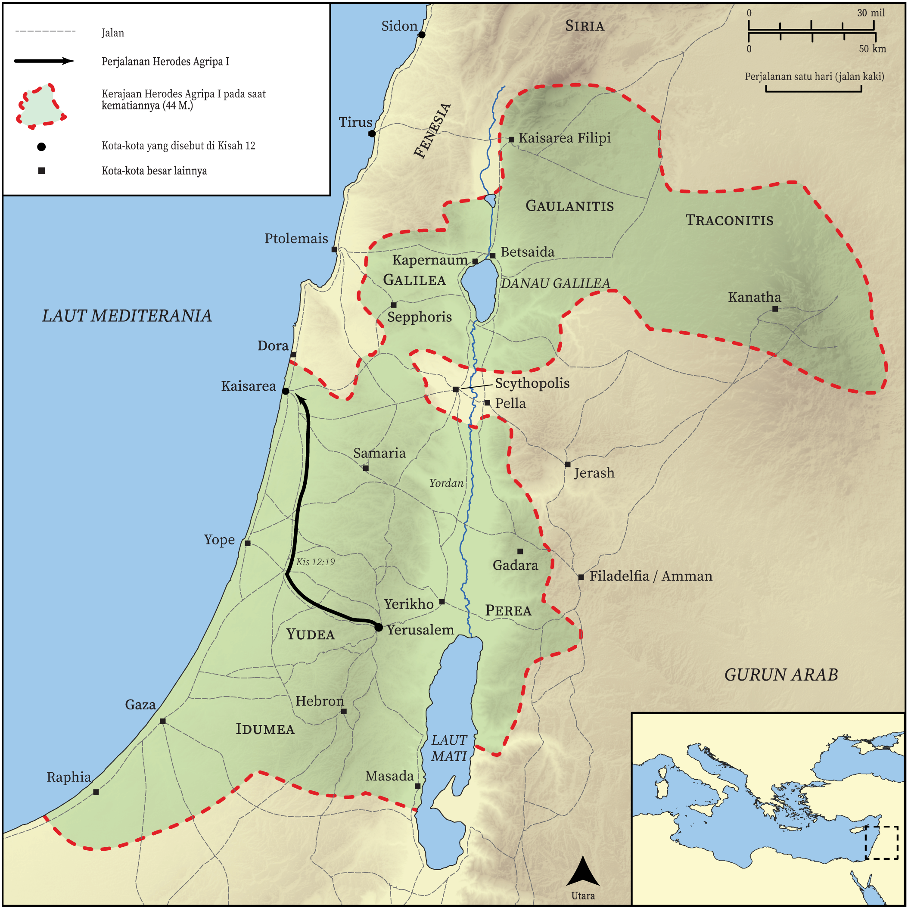

# Peta Alkitab Terbuka Biblica

## License Information

Biblica Open Bible Maps, © 2023–2025 Biblica, Inc. This work is licensed under Creative Commons Attribution-ShareAlike 4.0 International (<a href="https://creativecommons.org/licenses/by-sa/4.0/">https://creativecommons.org/licenses/by-sa/4.0/</a>). More Information: <a href="https://docs.google.com/document/d/1Pp44yZ0Zdnd59vJHTrt2rPYq0SppfX5rZbPBt6mz37U/edit?tab=t.0#heading=h.oev9aj1ksvk2">https://docs.google.com/document/d/1Pp44yZ0Zdnd59vJHTrt2rPYq0SppfX5rZbPBt6mz37U/edit?tab=t.0#heading=h.oev9aj1ksvk2</a>

--------------------------------

## Paulus dan Gereja Mula-mula: Kematian Herodes Agripa I (id: NT038)

### Image Content

[link](images/NT038.png)

* **Associated Passages:** Kisah Para Rasul 12:1-25

* **Associated ACAI Concepts:** Petrus (ID: `person:Peter`); An Angel (ID: `deity:Angel`); Herodes (ID: `person:Herod.3`); Tuhan (ID: `deity:Lord`); Prison (ID: `realia:Prison`); Markus (ID: `person:Mark`); jemaat (ID: `keyterm:Church`); berdoa (ID: `keyterm:Pray`); A Group of People (ID: `group:GenericGroup`); benar (ID: `keyterm:True`); Jews (ID: `group:Jews`); Chain (ID: `realia:Chain`); Yakobus (ID: `person:James`); Rode (ID: `person:Rhoda`); Tyrians (ID: `group:Tyre`); Yohanes (ID: `person:John.2`); Temple (ID: `realia:Temple`); Door (ID: `realia:Door`); Blastus (ID: `person:Blastus`); Maria (ID: `person:Mary.5`); Yehuda (ID: `place:Judea`); Yerusalem (ID: `place:Jerusalem`); bimbang (ID: `keyterm:Discern`); Paulus (ID: `person:Paul`); Tirus (ID: `place:Tyre`); Sidon (ID: `place:Sidon`); Kaisarea (ID: `place:Caesarea`); paskah (ID: `keyterm:Passover`); Yakobus (ID: `person:James.3`); Sidonians (ID: `group:Sidon`); Cause of Joy (ID: `keyterm:CauseOfJoy`); melayani (ID: `keyterm:Serve`); melepaskan (ID: `keyterm:Rescue`); nama (ID: `keyterm:Name`); kemuliaan (ID: `keyterm:Glory`); memperdamaikan (ID: `keyterm:Peace`); Barnabas (ID: `person:Barnabas`); membujuk (ID: `keyterm:Persuade`); Bedroom (ID: `realia:Bedroom`); Sandal (ID: `realia:Sandal`); House (ID: `realia:House`); Clothing (ID: `realia:Clothing`); Judgment Seat (ID: `realia:JudgmentSeat`); Cloak (ID: `realia:Cloak`); Entrance (ID: `realia:Entrance`); Worm (ID: `fauna:Maggot`)
